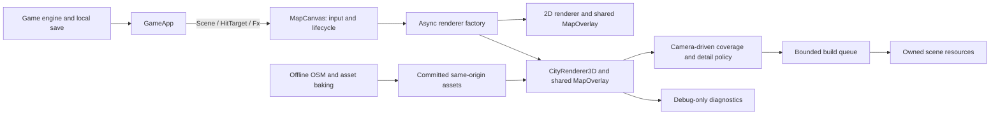

# Architecture and implementation contracts

These are **proposed runtime recovery contracts**, not APIs that already exist. They are complemented by [C6–C7 for faithful city reconstruction](fidelity.md); repairing this renderer does not itself satisfy the real-street recognition bar. R1–R6 introduce them in order. Read the current source first; preserve the public game/renderer surface. If profiling invalidates a choice, the tech lead records a replacement decision before assigning code.

## Preserve the useful boundaries



There is no backend service, live geodata feed, agent execution service or database to add. The orchestrator is a development workflow, not a runtime component of the game.

`Scene`, `HitTarget`, `CameraState` and `IMapRenderer` in `lib/game/scene.ts` stay compatible. In particular, preserve `fitAll`, `fitOverview`, `focusHub`, `lookAt`, `pan`, `zoomAt`, game hit testing, the four FX methods, camera handoff and `dispose`. Game marker picking remains in the shared 2D overlay; building inspection remains a separate visual interaction.

## File ownership

| Area                | Existing files                                                                    | Proposed small modules                                   | Owner                                                    |
| ------------------- | --------------------------------------------------------------------------------- | -------------------------------------------------------- | -------------------------------------------------------- |
| State/observability | `MapCanvas.tsx`, `CityRenderer3D.ts`                                              | `lib/game/mapDiagnostics.ts`, `render3d/diagnostics.ts`  | Runtime worker, serialized                               |
| Clock/hydration     | `CityHud.tsx`, `mapSearch.ts`                                                     | No new production module required                        | UI worker                                                |
| Asset lifecycle     | `landmarkPrefabs.ts`, `noticedPrefabs.ts`, `CityRenderer3D.ts`, `uniqueStreet.ts` | `render3d/sceneResources.ts`                             | Runtime worker, serialized                               |
| Spatial selection   | `format.ts`, `cityBuilder.ts`, `lookClip.ts`                                      | `render3d/cityIndex.ts`, `render3d/coverage.ts`          | Pure-helper worker, then runtime integrator              |
| Time/detail budgets | `cityBuilder.ts`, `chunkCells.ts`, `CityRenderer3D.ts`                            | `render3d/buildScheduler.ts`, `render3d/detailPolicy.ts` | Runtime worker, serialized                               |
| Street composition  | `buildingStyle.ts`, `palette.ts`, `footprint.ts`, `uniqueStock.ts`                | Extract a helper only if the assigned change needs it    | Street worker                                            |
| Named assets        | `landmarks.ts`, `uniqueNoticed.ts`, bake scripts and manifests                    | One asset recipe per approved feature                    | One asset worker at a time until recipes are independent |
| Browser QA          | Existing TS suites and SSR suite                                                  | `scripts/test-map-browser.mjs`, browser fixtures         | QA worker                                                |

Do not extract all 3,588 lines of `cityBuilder.ts` in one refactor. First introduce narrow seams with observable behavior preserved. Deeper extraction can follow a measured need.

## C1: observable state (R1)

Create the following browser-independent types in `lib/game/mapDiagnostics.ts`. They must not import `three`, a renderer or a browser global. Diagnostic callers use type-only imports as appropriate.

R1 now defines these fields in `MapDiagnostics`:

```ts
export type MapLoadState = 'loading' | 'ready' | 'degraded' | 'failed' | 'fallback' | 'disposed';
export interface MapDiagnostics {
  mode: '2d' | '3d' | null;
  state: MapLoadState;
  generation: number;
  camera: { x: number; y: number; zoom: number } | null;
  queuedJobs: number;
  pendingEssentialJobs: number;
  completedJobs: number;
  failedJobs: number;
  errorCount: number;
  errors: { jobId: string; essential: boolean; message: string }[];
  activeJobId: string | null;
  lastJob: { id: string; ms: number } | null;
  slowestJob: { id: string; ms: number } | null;
  residentCells: number | null;
  stockBuildings: number | null;
  stockDrawn: boolean | null;
  drawCalls: number | null;
  triangles: number | null;
  geometryBytes: number | null;
  textures: number | null;
  firstUsefulFrameMs: number | null;
  frameP95Ms: number | null;
  fallbackReason: string | null;
}
export interface MapQaBridge {
  snapshot(): Readonly<MapDiagnostics>;
}
```

These corrections to the earlier proposed types are intentional: initial actual mode/camera and unavailable measurements are null; `residentCells` stays unknown until R4; `failed` records essential failure before the host has actually selected 2D. `fallback` means 2D is selected, with first useful frame still null until it renders. Readiness never treats missing measurements as measured zero. The generation identifies the current canvas-host lifetime; R3/R6 extend replacement/cell ownership separately.

`createMapDiagnostics(generation, now)` is a pure reporter with an injected monotonic clock. It owns pending jobs and bounded histories, with register/start/complete/fail methods, explicit mode/camera/frame updates, terminal disposal and detached frozen snapshots. A 2D fallback ignores old 3D callbacks. Frame updates explicitly identify their renderer mode; mismatched/obsolete mode updates do nothing. All metrics for an accepted 3D frame are supplied together, so stale stock visibility cannot certify a new frame. `createBufferLedger()` accounts for shared ArrayBuffer identity across resource owners and supports replacement, idempotent release and clear.

`ready` requires completed essential jobs plus a frame that actually drew ordinary stock geometry, with positive stock/draw/triangle counts. Ground or a landmark alone is insufficient. `degraded` means that useful essential content exists but optional work failed. An essential failure cannot return to ready in the same generation. New essential work invalidates a previous ready state until a qualifying frame. Camera-driven coverage validation is still R4/R6; this gate alone does not prove geographic completeness.

Expose `window.__runwayQA` only with `?qa=1`; retain `?map=debug` context-loss control. Snapshots never expose Three.js objects or mutable internal maps. Publish actual mode/state attributes and fire the existing ready callback only after a useful 3D frame or an actual 2D frame, keeping the visible loading status aligned.

Measure active/last/slowest jobs with stable IDs. `activeJobId` is the most recently started unfinished job (parallel initial loaders may have other pending work); job counts and timings remain separate from frame costs. Keep latest 20 errors plus total `errorCount`. `frameP95Ms` is nearest-rank p95 over the latest 120 adapter-frame durations, including synchronous generation/render work; calculate it only on snapshot requests. It is not GPU timing or the browser RAF interval.

Read draw/triangle/texture counters after rendering, using [Three.js renderer information](https://threejs.org/docs/pages/WebGLRenderer.html). Track geometry buffers at attachment/load/disposal, never by traversing the whole scene every frame. Count unique backing buffers for indices, attributes, morph attributes, interleaved attributes and instanced transforms/colours. These are retained geometry-array bytes, including loaded prefab geometry; they exclude texture images, browser overhead and temporary CPU arrays, and are **not total GPU memory**. R3 owns comprehensive disposal of existing resources. Internal per-asset loader failures currently swallowed by prefab loaders remain R3 work; R1 reports the observable aggregate load and mesh-job failures without claiming a complete asset-error inventory.

R1 additionally owns the factory's typed reporter option so the callback can cross the existing dynamic boundary without widening `IMapRenderer` or importing Three.js into SSR.

## C2: asset replacement and lifecycle (R3)

Use `sceneResources.ts` to track ownership by scene generation/cell. Shared materials and prefab resources have a single owner or explicit reference count; removing a clone must not dispose a material still used by another clone.

- Increment the generation on replacement/dispose. Abort fetches where supported; reject and dispose late results from an obsolete generation. Clear pending jobs, scratch data, picking entries and event handlers.
- Separate **asset availability** from **stock exclusion**. Suppress an OSM footprint only after its replacement is available and scheduled for the active view. A missing, skipped, failed or parked replacement preserves stock coverage.
- Keep `no-1-poultry.glb` disabled in R3. Replace the hole with its ordinary OSM massing. Re-enabling a unique asset requires its own later feature card and browser evidence.
- Essential binary fetch/decode failure triggers the existing 2D fallback. Optional landmark/GLB failure uses an existing procedural or ordinary stock alternative and records the failure.
- A mesh-job failure has an ID, layer and essential/optional classification. Optional errors cannot silently disappear; essential failure cannot report success.
- Dispose geometry, materials and their owned textures; clear prefab maps and CPU references. Material disposal alone does not dispose its textures; see [Three.js cleanup guidance](https://threejs.org/manual/en/cleanup.html).

Do not assume `AbortController` cancels every GLTFLoader internal request. Generation checks and disposal of late returned objects are required even with abort support.

## C3: spatial index and coverage (R4)

Start with the existing **400 m** cell size; use the bbox's existing projection. Pure selection code operates on data and numbers. Avoid a new geospatial dependency.

```ts
// lib/game/render3d/cityIndex.ts
export type CellId = `${number},${number}`;
export interface BoundsXZ {
  minX: number;
  minZ: number;
  maxX: number;
  maxZ: number;
}
export interface CityCell {
  id: CellId;
  bounds: BoundsXZ;
  buildingIndices: readonly number[];
}
export interface CityIndex {
  cells: ReadonlyMap<CellId, CityCell>;
}
// CityData is the existing type in ./format; input must not be mutated.
export function indexCity(data: CityData, cellSizeM: number): CityIndex;

// lib/game/render3d/coverage.ts
export function cellsForBounds(index: CityIndex, bounds: BoundsXZ, padM: number): CellId[];
export function coverageDelta(
  resident: ReadonlySet<CellId>,
  wanted: readonly CellId[],
): { add: CellId[]; keep: CellId[]; remove: CellId[] };
```

Assign a building to exactly one owner cell using its centroid; expand that cell's bounds to include all owned footprints. This avoids duplicate buildings and missing boundary-straddling footprints. Stable sort cell IDs and building indices for reproducible output. An index is not geometry and does not build or upload meshes.

For the current orthographic camera, derive ground bounds from `CameraRig.groundUnproject()` at all viewport corners. Add a documented margin for tall-building silhouettes and one cell of prefetch. The renderer supplies these bounds to the pure selector. Test negative and bbox-edge coordinates, narrow portrait viewports, and a building crossing a cell boundary.

Cover geometry (roads/parks/water) must cover the same visible bounds. Cache or spatially restrict existing cover generation; do not leave cover in the old initial disk after buildings move. A 400 m grid is an initial engineering choice, not a reason to alter geography.

### R5b-4a cover selection seam

Use a separate world-origin 400 m cover grid, including cells with no building owner. Index original roads, parks and water by every cell intersecting each dequantized feature AABB. A long road or enclosing polygon must be selected even when none of its vertices lie inside the view. Keep the original CityData for water/crossing/RNG context; the index returns original numeric record indices, never a subset wrapper.

`createCoverIndexJob` implements C4 with at most 64 units per step and a default 4 ms target. Each record transition, vertex-pair AABB update and bucket insertion is a separate unit. Publication avoids whole-index copying or sorting. `coverForBounds` gathers intersecting buckets, filters feature AABBs, deduplicates and returns ascending original indices; query padding uses metres. Query loops are not an emission timing guarantee and must be measured in R6. No geometry or renderer hookup belongs to this helper acceptance.

This pure CPU index has no GPU resource ownership. It marks terminal and detaches private references before its one publication callback; cancellation or callback errors never mutate an already published index. Unpublished cancellation drops private state. The geometry-job disposal contract remains separate.

## C4: bounded generation and detail (R5)

Use one scheduler seam; measure time as well as queue length.

```ts
export interface BuildJob {
  id: string;
  generation: number;
  essential: boolean;
  // One bounded unit. Returns true only when this job is complete.
  step(): boolean;
  cancel(): void;
}
export interface DrainResult {
  completed: string[];
  failed: { id: string; essential: boolean; error: unknown }[];
  pending: number;
}
export interface BuildScheduler {
  enqueue(job: BuildJob): void;
  cancelGeneration(generation: number): void;
  drain(budgetMs: number, now: () => number): DrainResult;
}
```

`createBuildScheduler(): BuildScheduler` is the module factory. Use an injected clock in tests. Checking the time after one whole-city synchronous job does **not** meet the contract: work must be divided before expensive emission/upload. Target ≤4 ms generation slices on the reference desktop, record single-step overruns, and cap queued/resident resource growth.

Use three detail states: **overview massing**, **neighbourhood facades**, **near street detail**. Every state retains ordinary building massing. Window frames, decorative bays, lamps, trees and bespoke accents may reduce with distance; removing all minor buildings to meet a budget is forbidden. Create coarse massing from the same footprints; never build full facade detail for distant cells merely to hide it later.

The overview can show simplified city-wide massing from the committed data; close views replace nearby coarse cells with detailed ones, removing duplicates. If measurements show even coarse runtime generation is too expensive, the tech lead may approve a deterministic bake-time coarse asset in a new task. Workers must not quietly add a Worker, binary-format revision, Draco/Meshopt pipeline or a new rendering framework.

Preserve existing landmark geometry while testing scheduling/coverage. Keep shared materials reused. Prefetch and eviction need a bounded hysteresis ring to avoid rebuild thrash near cell borders.

### 9 September storage ruling: overview packing

[Actual cell-buffer accounting](evidence/R5b/cell-jobs/overview-budget.json) totals 186.12 MiB for the overview alone, so full Float32 normal/colour and Uint32 index storage cannot meet the 128 MiB initial ceiling. The next bounded packet may pack overview normals as normalized Int8, linear vertex colours as normalized Uint8, and indices as Uint16 when the vertex count permits (otherwise Uint32). Positions remain Float32 without modification; neighbourhood/street keep existing precision. Coverage, heights, footprint bounds and winding must remain unchanged. Normal/colour round-to-nearest errors are bounded by 0.5/127 and 0.5/255 per component, respectively.

This is an explicit storage contract revision for the API-only cell job, replacing exact overview normal/colour tuple equality with those bounded errors. Street tuple equality stays exact. Preserve incremental allocation/copy units and all accepted ownership/error semantics. Validate actual packed buffers and rendered output, then repeat aggregate accounting. The [verified compact overview accounting](evidence/R5b/compact-overview/README.md) is 93.06 MiB, exactly half the prior buffers with unchanged emitted coverage. This cost still excludes cover, heroes, detailed cells and overhead; it does not approve G1 or a higher resident budget. No new binary, bake, dependency or shader pipeline is authorized.

## C5: renderer integration (R6)

`CityRenderer3D` remains the adapter that joins the preceding modules. Refresh coverage when camera bounds, zoom tier or viewport materially change, including `fitOverview`, `focusHub`, `lookAt`, pan, zoom and query changes. Avoid rebuilding on every pointer pixel: compare required cell sets/detail tiers.

Maintain a persistent cheap city context and a bounded detailed neighbourhood. Keep the previous useful cells until replacements are ready, subject to the approved resident budget. On a distant search jump, show loading for that destination while coarse context is visible; do not show an empty world marked ready. Eviction must remove scene objects, GPU resources, pick targets, minor-mesh references and scratch data together.

Queue priority: essential visible stock/cover, visible landmarks, prefetch stock, optional detail. Readiness is per camera generation and needs a successful rendered frame. `?look=` and `?view=` choose reproducible cameras, **not alternate correctness or safety behavior**. Different performance tiers may be chosen by real device capability and viewport/detail needs.

## Deliberate tradeoffs and deferred choices

- Retain Three.js and the two-canvas architecture: it preserves gameplay and avoids another rewrite. Revisit only if G0 proves the supported device target cannot be met after a bounded spike.
- Camera-driven detail is more involved than a fixed disk, but supports the already-exposed pan/search/overview behavior. Artificially restricting exploration would be a product change, not a bug fix.
- Keep existing baked/procedural heroes at G1. Choose one authoritative source per asset when its G3 card is reviewed; avoid maintaining an active code builder and contradictory baked mesh.
- Use lightweight browser automation as a development dependency for regression QA. Exact tooling/version is chosen in R0 using the existing environment; it has no production-bundle dependency.
- Source photos and geospatial observations also inform ordinary-building facades and distinctive street objects through F0–F6. Runtime tasks do not choose or add that pipeline independently. Source photos are references for individual real forms. Do not solve a 3D shape objection with a single photo pasted on a box and count the screenshot as a multi-angle model.
