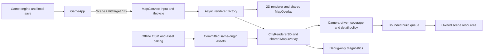

# Architecture and implementation contracts

These are **proposed runtime recovery contracts**, not APIs that already exist. They are complemented by [C6–C7 for faithful city reconstruction](fidelity.md); repairing this renderer does not itself satisfy the real-street recognition bar. R1–R6 introduce them in order. Read the current source first; preserve the public game/renderer surface. If profiling invalidates a choice, the tech lead records a replacement decision before assigning code.

## Preserve the useful boundaries



There is no backend service, live geodata feed, agent execution service or database to add. The orchestrator is a development workflow, not a runtime component of the game.

`Scene`, `HitTarget`, `CameraState` and `IMapRenderer` in `lib/game/scene.ts` stay compatible. In particular, preserve `fitAll`, `fitOverview`, `focusHub`, `lookAt`, `pan`, `zoomAt`, game hit testing, the four FX methods, camera handoff and `dispose`. Game marker picking remains in the shared 2D overlay; building inspection remains a separate visual interaction.

## File ownership

| Area                | Existing files                                                                    | Proposed small modules                                   | Owner                                                    |
| ------------------- | --------------------------------------------------------------------------------- | -------------------------------------------------------- | -------------------------------------------------------- |
| State/observability | `MapCanvas.tsx`, `CityRenderer3D.ts`                                              | `lib/game/mapDiagnostics.ts`, `render3d/diagnostics.ts`  | Runtime worker, serialized                               |
| Clock/hydration     | `CityHud.tsx`, `mapSearch.ts`                                                     | No new production module required                        | UI worker                                                |
| Asset lifecycle     | `landmarkPrefabs.ts`, `noticedPrefabs.ts`, `CityRenderer3D.ts`, `uniqueStreet.ts` | `render3d/sceneResources.ts`                             | Runtime worker, serialized                               |
| Spatial selection   | `format.ts`, `cityBuilder.ts`, `lookClip.ts`                                      | `render3d/cityIndex.ts`, `render3d/coverage.ts`          | Pure-helper worker, then runtime integrator              |
| Time/detail budgets | `cityBuilder.ts`, `chunkCells.ts`, `CityRenderer3D.ts`                            | `render3d/buildScheduler.ts`, `render3d/detailPolicy.ts` | Runtime worker, serialized                               |
| Street composition  | `buildingStyle.ts`, `palette.ts`, `footprint.ts`, `uniqueStock.ts`                | Extract a helper only if the assigned change needs it    | Street worker                                            |
| Named assets        | `landmarks.ts`, `uniqueNoticed.ts`, bake scripts and manifests                    | One asset recipe per approved feature                    | One asset worker at a time until recipes are independent |
| Browser QA          | Existing TS suites and SSR suite                                                  | `scripts/test-map-browser.mjs`, browser fixtures         | QA worker                                                |

Do not extract all 3,588 lines of `cityBuilder.ts` in one refactor. First introduce narrow seams with observable behavior preserved. Deeper extraction can follow a measured need.

## C1: observable state (R1)

Create the following browser-independent types in `lib/game/mapDiagnostics.ts`. They must not import `three`, a renderer or a browser global. Diagnostic callers use type-only imports as appropriate.

```ts
export type MapLoadState = 'loading' | 'ready' | 'degraded' | 'fallback' | 'disposed';
export interface MapDiagnostics {
  mode: '2d' | '3d';
  state: MapLoadState;
  generation: number;
  camera: { x: number; y: number; zoom: number };
  queuedJobs: number;
  completedJobs: number;
  failedJobs: number;
  errors: { jobId: string; essential: boolean; message: string }[];
  residentCells: number;
  stockBuildings: number;
  drawCalls: number;
  triangles: number;
  geometryBytes: number;
  textures: number;
  firstUsefulFrameMs: number | null;
  frameP95Ms: number | null;
  fallbackReason: string | null;
}
export interface MapQaBridge {
  snapshot(): Readonly<MapDiagnostics>;
}
```

Expose `window.__runwayQA` only with `?qa=1`; keep `?map=debug` context-loss control. Update numeric counters without traversing the whole scene every frame. Report renderer draw/triangle counters after rendering; count geometry buffer bytes by unique buffer identity at resource creation/disposal. These bytes exclude textures, browser overhead and temporary CPU arrays: **not total GPU memory**. Estimate JS heap/process memory separately during profiling where supported.

`ready` means essential layers for the current view have built and a nonempty 3D frame has rendered. `degraded` means optional work failed while essential content is useful. `fallback` means the 2D renderer is active. Empty stock or failed essential cover must never report a successful 3D-ready state. The visible loading status and diagnostics must agree. Screenshots still verify the pixels; counters are not an art-quality score.

## C2: asset replacement and lifecycle (R3)

Use `sceneResources.ts` to track ownership by scene generation/cell. Shared materials and prefab resources have a single owner or explicit reference count; removing a clone must not dispose a material still used by another clone.

- Increment the generation on replacement/dispose. Abort fetches where supported; reject and dispose late results from an obsolete generation. Clear pending jobs, scratch data, picking entries and event handlers.
- Separate **asset availability** from **stock exclusion**. Suppress an OSM footprint only after its replacement is available and scheduled for the active view. A missing, skipped, failed or parked replacement preserves stock coverage.
- Keep `no-1-poultry.glb` disabled in R3. Replace the hole with its ordinary OSM massing. Re-enabling a unique asset requires its own later feature card and browser evidence.
- Essential binary fetch/decode failure triggers the existing 2D fallback. Optional landmark/GLB failure uses an existing procedural or ordinary stock alternative and records the failure.
- A mesh-job failure has an ID, layer and essential/optional classification. Optional errors cannot silently disappear; essential failure cannot report success.
- Dispose geometry, materials and their owned textures; clear prefab maps and CPU references. Material disposal alone does not dispose its textures; see [Three.js cleanup guidance](https://threejs.org/manual/en/cleanup.html).

Do not assume `AbortController` cancels every GLTFLoader internal request. Generation checks and disposal of late returned objects are required even with abort support.

## C3: spatial index and coverage (R4)

Start with the existing **400 m** cell size; use the bbox's existing projection. Pure selection code operates on data and numbers. Avoid a new geospatial dependency.

```ts
// lib/game/render3d/cityIndex.ts
export type CellId = `${number},${number}`;
export interface BoundsXZ {
  minX: number;
  minZ: number;
  maxX: number;
  maxZ: number;
}
export interface CityCell {
  id: CellId;
  bounds: BoundsXZ;
  buildingIndices: readonly number[];
}
export interface CityIndex {
  cells: ReadonlyMap<CellId, CityCell>;
}
// CityData is the existing type in ./format; input must not be mutated.
export function indexCity(data: CityData, cellSizeM: number): CityIndex;

// lib/game/render3d/coverage.ts
export function cellsForBounds(index: CityIndex, bounds: BoundsXZ, padM: number): CellId[];
export function coverageDelta(
  resident: ReadonlySet<CellId>,
  wanted: readonly CellId[],
): { add: CellId[]; keep: CellId[]; remove: CellId[] };
```

Assign a building to exactly one owner cell using its centroid; expand that cell's bounds to include all owned footprints. This avoids duplicate buildings and missing boundary-straddling footprints. Stable sort cell IDs and building indices for reproducible output. An index is not geometry and does not build or upload meshes.

For the current orthographic camera, derive ground bounds from `CameraRig.groundUnproject()` at all viewport corners. Add a documented margin for tall-building silhouettes and one cell of prefetch. The renderer supplies these bounds to the pure selector. Test negative and bbox-edge coordinates, narrow portrait viewports, and a building crossing a cell boundary.

Cover geometry (roads/parks/water) must cover the same visible bounds. Cache or spatially restrict existing cover generation; do not leave cover in the old initial disk after buildings move. A 400 m grid is an initial engineering choice, not a reason to alter geography.

## C4: bounded generation and detail (R5)

Use one scheduler seam; measure time as well as queue length.

```ts
export interface BuildJob {
  id: string;
  generation: number;
  essential: boolean;
  // One bounded unit. Returns true only when this job is complete.
  step(): boolean;
  cancel(): void;
}
export interface DrainResult {
  completed: string[];
  failed: { id: string; essential: boolean; error: unknown }[];
  pending: number;
}
export interface BuildScheduler {
  enqueue(job: BuildJob): void;
  cancelGeneration(generation: number): void;
  drain(budgetMs: number, now: () => number): DrainResult;
}
```

`createBuildScheduler(): BuildScheduler` is the module factory. Use an injected clock in tests. Checking the time after one whole-city synchronous job does **not** meet the contract: work must be divided before expensive emission/upload. Target ≤4 ms generation slices on the reference desktop, record single-step overruns, and cap queued/resident resource growth.

Use three detail states: **overview massing**, **neighbourhood facades**, **near street detail**. Every state retains ordinary building massing. Window frames, decorative bays, lamps, trees and bespoke accents may reduce with distance; removing all minor buildings to meet a budget is forbidden. Create coarse massing from the same footprints; never build full facade detail for distant cells merely to hide it later.

The overview can show simplified city-wide massing from the committed data; close views replace nearby coarse cells with detailed ones, removing duplicates. If measurements show even coarse runtime generation is too expensive, the tech lead may approve a deterministic bake-time coarse asset in a new task. Workers must not quietly add a Worker, binary-format revision, Draco/Meshopt pipeline or a new rendering framework.

Preserve existing landmark geometry while testing scheduling/coverage. Keep shared materials reused. Prefetch and eviction need a bounded hysteresis ring to avoid rebuild thrash near cell borders.

## C5: renderer integration (R6)

`CityRenderer3D` remains the adapter that joins the preceding modules. Refresh coverage when camera bounds, zoom tier or viewport materially change, including `fitOverview`, `focusHub`, `lookAt`, pan, zoom and query changes. Avoid rebuilding on every pointer pixel: compare required cell sets/detail tiers.

Maintain a persistent cheap city context and a bounded detailed neighbourhood. Keep the previous useful cells until replacements are ready, subject to the approved resident budget. On a distant search jump, show loading for that destination while coarse context is visible; do not show an empty world marked ready. Eviction must remove scene objects, GPU resources, pick targets, minor-mesh references and scratch data together.

Queue priority: essential visible stock/cover, visible landmarks, prefetch stock, optional detail. Readiness is per camera generation and needs a successful rendered frame. `?look=` and `?view=` choose reproducible cameras, **not alternate correctness or safety behavior**. Different performance tiers may be chosen by real device capability and viewport/detail needs.

## Deliberate tradeoffs and deferred choices

- Retain Three.js and the two-canvas architecture: it preserves gameplay and avoids another rewrite. Revisit only if G0 proves the supported device target cannot be met after a bounded spike.
- Camera-driven detail is more involved than a fixed disk, but supports the already-exposed pan/search/overview behavior. Artificially restricting exploration would be a product change, not a bug fix.
- Keep existing baked/procedural heroes at G1. Choose one authoritative source per asset when its G3 card is reviewed; avoid maintaining an active code builder and contradictory baked mesh.
- Use lightweight browser automation as a development dependency for regression QA. Exact tooling/version is chosen in R0 using the existing environment; it has no production-bundle dependency.
- Source photos and geospatial observations also inform ordinary-building facades and distinctive street objects through F0–F6. Runtime tasks do not choose or add that pipeline independently. Source photos are references for individual real forms. Do not solve a 3D shape objection with a single photo pasted on a box and count the screenshot as a multi-angle model.
