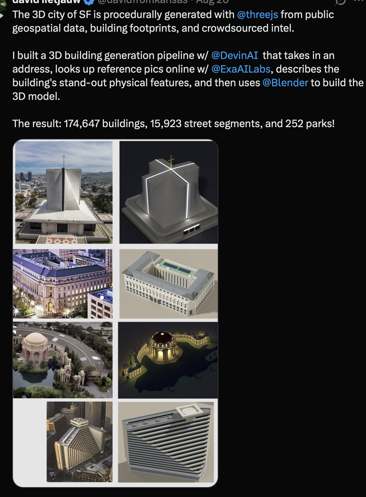

# F0: owner-supplied SFSIM reference

Recorded: 5 September 2026. Foo supplied this screenshot after direct X access returned HTTP 403. The screenshot was visually inspected and copied unchanged into this evidence directory. It supplies the missing workflow text and four photograph/model comparisons.

- Artifact: [owner-sfsim-reference.png](owner-sfsim-reference.png), 1074 × 1458 pixels, 1,186,083 bytes.
- SHA-256: `6e98ce0ad0edb85305155fd550ccf705d388166a3cdad2dfbb925eaa7b4c58d5`.
- Associated owner references: [workflow post](https://x.com/davidfromkansas/status/2090527551961940028) and [detail post](https://x.com/davidfromkansas/status/2090527554310635552). The cropped screenshot contains no status URL, so it is not independently assigned to one of those IDs.
- Evidence state: **workflow text and static model-detail reference inspected**. No video, camera motion, full application, source repository or executable generation pipeline was supplied or independently checked.

## What the creator states

The visible post describes a Three.js city made from public geospatial data, building footprints and crowdsourced information. The author says they built a building-generation pipeline with Devin: it accepts an address, finds online reference photographs with Exa, describes distinguishing physical features, and uses Blender to construct a 3D model.

The post reports 174,647 buildings, 15,923 street segments and 252 parks. Those are **creator-reported scene counts**. They do not establish how many buildings received an individual image-to-model reconstruction, the time/cost/error rate of that process, or accurate coverage of every tree and sign. Do not use them as a London delivery estimate.

## What the images demonstrate

Rows below refer to the four photograph/model pairs from top to bottom. Building names are unnecessary to interpret the visible features and have not been independently established here.

| Pair                                | Distinguishing features visible in the comparison                                                                                                                                          | Implication for London workers                                                                                                                                 |
| ----------------------------------- | ------------------------------------------------------------------------------------------------------------------------------------------------------------------------------------------ | -------------------------------------------------------------------------------------------------------------------------------------------------------------- |
| 1: sculptural church-like structure | Tall folded/curving concrete form, strong central vertical/cross motif, broad low base and entrance band. The model retains the overall sculptural shape while simplifying surface detail. | Model the actual silhouette, roof transition and major feature; a textured rectangular extrusion would lose its identity.                                      |
| 2: courtyard block                  | Pale multi-storey frontage, repeated openings, grey pitched/mansard-like perimeter roof and substantial internal court/roof arrangement.                                                   | Preserve the building's overall plan, roof profile, facade rhythm and internal voids. A shared window kit still needs instance-specific dimensions and counts. |
| 3: rotunda and colonnades           | A dominant dome, circular columned volume, curving side colonnades and relationship to surrounding water. The model comparison uses night lighting.                                        | Reproduce the connected shape and setting. This one night render does not require a day/night feature in RUNWAY.                                               |
| 4: angular high-rise                | Distinctive angled footprint, strong horizontal window bands, stepped diagonal edge and characteristic roof shape.                                                                         | Derive footprint, proportions, setbacks and facade banding from this actual building rather than assigning a generic tower type.                               |

**Working visual interpretation:** simplified, clean 3D forms with recognizable real-building structure. The screenshot supports preserving silhouette, proportion, openings, materials and standout features with economical geometry. It does not require photorealistic textures or microscopic detail. Foo's additional requirement still applies to ordinary streets and observed trees/signs; these four selected examples do not demonstrate that wider coverage.

The views are elevated three-quarter asset comparisons. Exact projection, lens, camera controls, pedestrian movement, frame rate and consistency across a continuous street cannot be inferred from them. London close exploration remains an explicit F5 implementation/acceptance requirement.

## London translation and reference status

Use [the address-to-asset workflow](../../fidelity.md#address-to-asset-workflow) to implement the same sequence with Codex as tech lead and bounded research, feature-description, modelling and review tasks. Exa and Devin are named in the creator's account; their brands are not dependencies that every London worker must obtain. Blender is the planned baker for distinctive reconstruction; shared primitives may use existing bake code when the result passes the same visual checks.

F0's workflow/building-detail brief is now recorded and reviewable. **No owner input is pending to start R0/F1 or to use this static visual benchmark.** If motion footage becomes available, append its observations without reopening settled product direction. Until then, never claim to have reproduced unseen camera behavior or independently verified the creator's complete city. G2 still requires Foo's approval of the actual continuous London pilot, real-place evidence and runtime checks.
