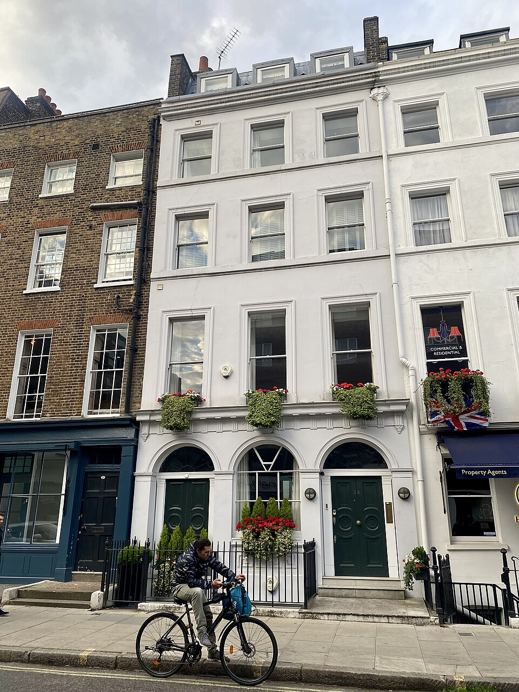
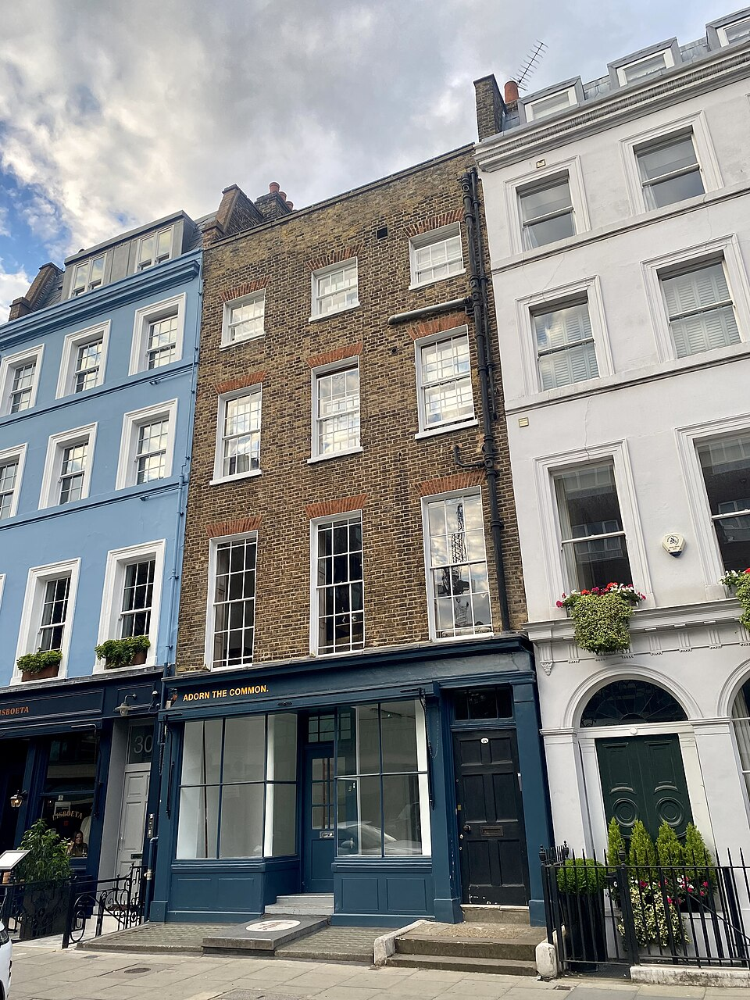

# F1 checkpoint: Charlotte Street source feasibility

Recorded: 5 September 2026. **Initial source sample, not an F1 GO or an approved modelling packet.** This advances the planning handoff with real London inputs after F0's workflow reference became available. No runtime code or game assets were changed.

## Candidate route and map evidence

The connected OpenStreetMap road ways `1301782548`, `4068454` and `30279582` provide a south-to-north candidate from the **Percy Street junction** (51.5180299, -0.1342984) to the **Tottenham Street junction** (51.5200969, -0.136436). The route is approximately **273.3 m along the road centreline**, calculated by summing haversine distances between its vertices. This is not a surveyed pedestrian travel distance. Shared junction node membership identifies the endpoint streets.

[The pinned source sample](source-sample.json) preserves the route vertices, selected feature IDs/versions, imagery metadata and hashes. The initial Overpass query returned HTTP 504; the bounded [OpenStreetMap map API](https://api.openstreetmap.org/api/0.6/map?bbox=-0.14,51.518,-0.134,51.5215) succeeded. Map data is attributed to [OpenStreetMap contributors](https://www.openstreetmap.org/copyright). The full authoring bbox, all frontage buildings and the tree/street-object inventory remain to be established.

| Address             | Map record                                                                                                                           | Image evidence / verdict                                                                                                                                                                                                                                                                                                                            |
| ------------------- | ------------------------------------------------------------------------------------------------------------------------------------ | --------------------------------------------------------------------------------------------------------------------------------------------------------------------------------------------------------------------------------------------------------------------------------------------------------------------------------------------------- |
| 26 Charlotte Street | [way 138339533](https://www.openstreetmap.org/way/138339533), version 8; four building levels plus a roof level; white/plaster tags. | The May 2022 photo visibly shows number 26, a pale three-bay frontage, three rows of upper windows, dormers, three ground-level arches, dark green doors and railings. Good first frontage candidate; full roof/rear geometry, metric dimensions and present condition remain unverified.                                                           |
| 28 Charlotte Street | [way 138339551](https://www.openstreetmap.org/way/138339551), version 8; four levels, brown/brick tags.                              | The May 2022 photo shows an adjacent brown-brick three-bay facade with differing window heights, brick window heads and a dark teal shopfront. Adjacency to 26 supports a candidate match. Roof depth, rear shape, metric dimensions and current shopfront need further evidence.                                                                   |
| 30 Charlotte Street | [way 138339531](https://www.openstreetmap.org/way/138339531), version 7; five levels, white/plaster tags.                            | **Reject the downloaded May 2023 candidate as an address match.** Its Commons title says Charlotte Street, but its linked heritage ID `1379038` is officially **30 Tottenham Street**. The image also shows a two-bay brick building, conflicting with the adjacent frontage visible in the 28 photo. Do not feed it to the Charlotte model recipe. |

The identity conflict is independently supported by [Historic England's entry 1379038](https://historicengland.org.uk/listing/the-list/list-entry/1379038?section=comments-and-photos). This is a useful real rejection fixture for the address-to-photo stage: a plausible filename and visible house number do not establish the street.

An approximate local-planar calculation on the retrieved footprint gives 26 Charlotte Street an area of **77 m²**. That is below the historical committed ingest's 90 m² area floor. It is a concrete reason to verify small frontage survival in the fidelity ingest; this sample does not prove that the current rendered binary omits this exact building.

## Inspected photo evidence and attribution

All three images below are Wikimedia-supplied thumbnails downloaded unchanged. Author: [No Swan So Fine](https://commons.wikimedia.org/wiki/User:No_Swan_So_Fine). Each source's metadata declares [CC BY-SA 4.0](https://creativecommons.org/licenses/by-sa/4.0/). Source pages, originals, dates and artifact hashes are preserved in `source-sample.json`. These are reference evidence in documentation, not shipped game textures. The returned metadata had no GPS coordinates, so placement cannot be copied from it. Incidental people/vehicles are not model requirements.

| Candidate                                             | Source / capture date                                                                                                     | Saved reference                                  |
| ----------------------------------------------------- | ------------------------------------------------------------------------------------------------------------------------- | ------------------------------------------------ |
| 26                                                    | [Original source page](https://commons.wikimedia.org/wiki/File:26_Charlotte_Street,_Fitzrovia,_May_2022.jpg), 28 May 2022 | [Inspected thumbnail](candidate-26.jpg)          |
| 28                                                    | [Original source page](https://commons.wikimedia.org/wiki/File:28_Charlotte_Street,_Fitzrovia,_May_2022.jpg), 28 May 2022 | [Inspected thumbnail](candidate-28.jpg)          |
| Labelled 30 Charlotte Street; rejected identity match | [Original source page](https://commons.wikimedia.org/wiki/File:30_Charlotte_Street,_Fitzrovia,_May_2023.jpg), 26 May 2023 | [Rejected candidate thumbnail](candidate-30.jpg) |

| 26: pale arched frontage                                       | 28: brick shopfront                                            |
| -------------------------------------------------------------- | -------------------------------------------------------------- |
|  |  |

## Supporting source and tool availability

Camden's [Charlotte Street conservation appraisal](https://www.camden.gov.uk/documents/20142/7323179/Charlotte%2BStreet.pdf/9ac63c8a-4be2-2dd3-879d-3553e43317c2) was adopted in July 2008 and describes survey work from early 2007. It provides useful historical townscape and material context, but cannot establish the current position/appearance of every tree, sign or shopfront. Use current/dated instance evidence alongside it.

`/opt/homebrew/bin/blender --version` succeeded and reported **Blender 5.1.2**. The repo's `scripts/bake-noticed.ts` already invokes `scripts/blender_noticed.py` with a job file. This proves local tool availability and an existing integration convention; no pilot model or Blender export test was run in this checkpoint.

## Next bounded work

1. Inventory every frontage and salient street feature along both sides of the 273 m candidate; fix a source-backed authoring bbox and three control points.
2. Extend/refresh reference coverage, with a second useful viewpoint and height/roof evidence for 26 and 28. Resolve storefront survey dates and collect the correct evidence for 30. Do not infer today's signs from old photographs.
3. Inspect actual tree and street-furniture coverage; the existence of a city-wide catalogue does not prove this route is covered.
4. Produce a per-field coverage/uncertainty matrix and complete F1's GO/NO-GO decision, with acquisition options if gaps remain. Only then issue F2/F3 modelling packets.

**Current verdict:** there is enough specific evidence to continue source feasibility, and the photo-matching stage has a concrete failure case to catch. There is not yet enough coverage to approve the full pilot or begin unattended asset generation. No owner clarification is pending for the next source-audit work.
