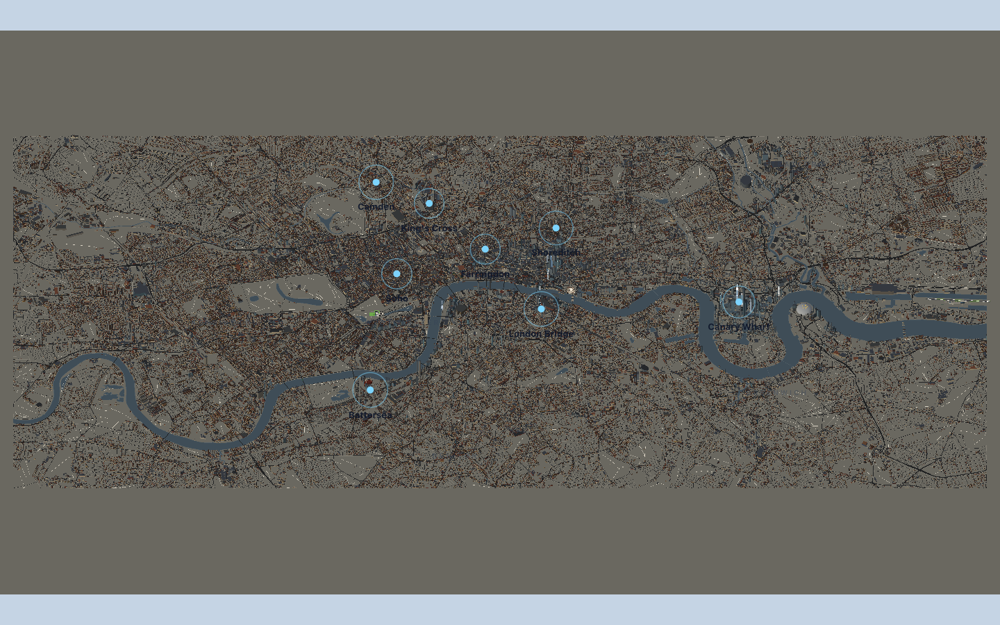

# Native wide-view draw attribution

Runtime: `1a9517f`, source-identical to tested `0e3a314`. The persistent
testing agent inspected two consecutive native-Chrome frames in the same
wide zero-angle view. This is draw attribution, not startup timing, GPU
execution cost, a future optimization floor, or acceptance.

Both frames reproduced 2,390 calls, 1,908,689 triangles and 130,812,722
tracked geometry bytes. Every `renderBufferDirect` invocation produced
one WebGL draw: 2,388 `drawElements` and two `drawArrays` calls, with no
unattributed calls. The visible scene submitted 2,382 meshes and eight
sprites; two hidden selection-beam meshes submitted nothing.

| Layer | Submitted calls | Triangles |
| --- | ---: | ---: |
| Stock | 1,609 | 1,337,187 |
| Roads/pavements | 210 | 393,325 |
| Water/banks | 116 | 12,952 |
| Parks/paths | 204 | 124,573 |
| Tree cover | 0 | 0 |
| Landmarks | 208 | 33,754 |
| Noticed replacements | 34 | 6,880 |
| Ground and hub glows | 9 | 18 |
| Total | 2,390 | 1,908,689 |

Measured non-stock calls are **781 = 530 cover + 242 landmarks/replacements
+ 9 other**. The previous feasibility report inferred this contribution;
this inventory now measures it. It does not imply those draws cannot be
reduced. Stock batching alone cannot meet the 300-call target with these
other layers unchanged.

Grass contributes 106 calls, pavement and asphalt 105 each, park paths 98,
and water surfaces and banks 58 each. The largest replacement groups are
Buckingham (30), Eye and Old Street (20 each), LCY (18), Tower Bridge (17),
Charrington Tower (16) and Tower of London (11). Similar material signatures
do not establish shared material instances. Road markings and tree cover
contribute zero in this overview. The HTML/Canvas2D HUD is outside the WebGL
total.

The agent restored hooks, camera and counters, confirmed unchanged city
pixels, and stopped owned processes. Historical saves/evidence were
preserved. There was one favicon 404 and no captured page error. No second
angle or acceptance replay was performed. Diagnostic pauses and instrumented
frames must be excluded from performance claims.

- [Summary](browser-inventory-1a9517f/summary.json)
- [Layer table](browser-inventory-1a9517f/categories.csv)
- [Group table](browser-inventory-1a9517f/groups.csv)
- [Provenance](browser-inventory-1a9517f/provenance.json)
- [Complete draw frames](https://app.devin.ai/attachments/e4857881-439c-4427-9452-4780aa36c95c/draw-frames.json)
- [Scene/material inventory](https://app.devin.ai/attachments/ef899750-a0e8-4b57-8766-40c6e09a4381/scene-inventory.json)
- [Recording](https://app.devin.ai/attachments/8a6d83dc-e23a-499f-b26b-29966c9bd229/runway-native-inventory-edited.mp4)

