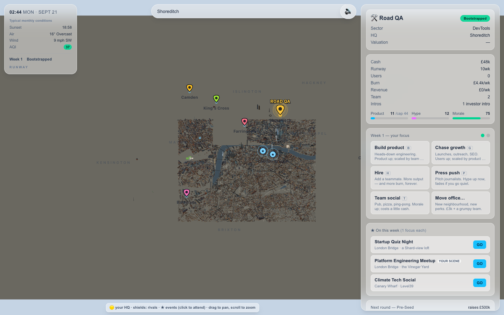
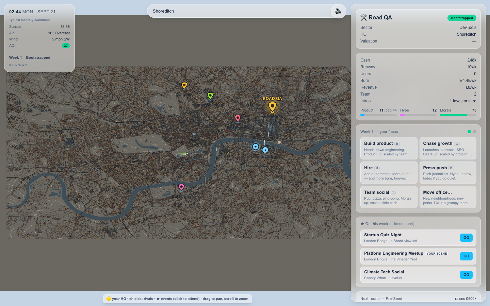

# Native browser validation — overview stock pages

Source `cc0d2d2`, documentation HEAD `585f370`. **Limited improvement accepted;
runtime release not accepted.** Native Chrome 153.0.8010.48, ANGLE Metal /
Apple Paravirtual device, desktop 1440×900 DPR1. The persistent testing agent
used the existing production build with no concurrent build/profile work.
Baseline is preserved `0e3a314` evidence, not a contemporaneous paired run.

Full [report](browser-stock-cc0d2d2/result.md),
[measurements](browser-stock-cc0d2d2/final-measurements.json),
[raw observations](browser-stock-cc0d2d2/observations.json) and
[cleanup](browser-stock-cc0d2d2/cleanup.json).

## Measured result

| Matched angle | Baseline → candidate calls | Candidate triangles | Candidate geometry bytes |
| --- | ---: | ---: | ---: |
| Zero | 2390 → 905 | 1,908,689 | 130,812,722 |
| St Paul's | 2351 → 900 | 1,895,193 (+6,079) | 130,812,722 |
| Eye | 2148 → 868 | 1,844,302 (+26,375) | 127,349,543 (+955,920) |

Zero-angle calls fall 62.13% with exact triangle/byte equality. All views still
exceed 300 calls; all canonical candidate samples remain below 2M triangles
and 128MiB geometry. Larger stock tiles change frustum/residency work at other
angles: do not claim exact matched-workload parity there.

| Startup pair | Cold ms | Reload ms |
| --- | ---: | ---: |
| Default 1 | 4832.5 | 4139.2 |
| Default 2 | 5151.7 | 4298.7 |
| Wide 1 | 12063.9 | 11241.0 |
| Wide 2 | 13321.0 | 11780.5 |

All eventually rendered useful city pixels. All four wide observations and
one default cold sample fail the five-second target. Historical baseline /
candidate wide medians are 13674.35 / 12692.45ms cold and 13088.70 / 11510.75ms
reload; small non-contemporaneous samples do not establish causal improvement.
Fresh process/profile per pair and disabled HTTP cache do not reset OS,
driver, compiler or shader caches.

## New acceptance failure: reverse-zoom coverage

Returning wide after 30ms or 500ms near-view holds dropped visible stock from
about 113.5k to 20k. Stock regenerated in about 2.4–2.5s; essential work settled
6.4–6.7s after returning wide. These sampled diagnostic intervals are not
startup timing measurements. Recovery passed; uninterrupted continuity failed.
The source review's synthetic short-window disclosure understated the native
user-visible duration. No persistent hole, duplicate exposed cell or attached
hidden replacement was sampled.

| Interrupted overview | Recovered overview |
| --- | --- |
|  |  |

The same stock worker is correcting admission/eviction/transition behavior
from `cc0d2d2`. It must preserve the 128MiB ceiling rather than restoring the
earlier 150.88/132.03MiB overlap. Parent owns independent review and integration.

## Working behavior and remaining limits

Desktop held-pan p95: 20.5ms default / 19.7ms wide (1800 rAF intervals each).
Fitzrovia, Shoreditch, Canary Wharf, Battersea and Camden tours, Residence /
Business picks, Build and exact save/reload passed. The corrected prefix
Continue locator passed; its initial exact-locator timeout and invalid
title-overlay pick remain recorded.

Warm loop plus three repeated settled tours returned 131,137,538 bytes,
1100 geometries, one texture and zero stock staging/hidden/pending work.
That warmed overview has **1105 calls / 1,914,059 triangles**, distinct from
the cold canonical 905 calls. No resource-growth claim extends to physical
driver reclamation or all intermediate peaks.

Optional manifest 503 retained ordinary Canary Wharf stock and a Business
pick in degraded 3D. Essential binary failure and WebGL context loss both
kept the game playable in Canvas. Context loss cleared tracked 3D resources.
Individual landmark-GLB failure was not tested in this run.

390×844 DPR2/coarse-touch emulation rendered useful city in 4888.2ms;
touch-pan p95 19.9ms and Build passed. This is not physical-device/Safari
validation. Eleven favicon 404s, deliberate fault 503s and fallback aborts
remain documented; no captured page errors/crashes.

Geometry/staging counters do not comprehensively include cover/tree/decor/hero
staging, CPU arrays, browser heap, textures/materials or driver allocations.
Physical Safari, formal London fidelity, GPU execution latency and physical
reclamation remain untested. Historical failures are not superseded.

Recordings: [startup](https://app.devin.ai/attachments/ee1948a9-eafc-4a18-8bcf-7976dd719be6/runway-stock-startup-edited.mp4),
[gameplay](https://app.devin.ai/attachments/397eb478-568e-4635-9cd3-29f7c1672178/runway-stock-game-edited.mp4),
[reversal/resources](https://app.devin.ai/attachments/8167fd05-5960-4465-8691-57142b893c31/runway-stock-streaming-edited.mp4),
[faults/touch](https://app.devin.ai/attachments/97952ec3-b3ae-4af1-852e-dc577f1e7bfd/runway-stock-faults-touch-edited.mp4).
