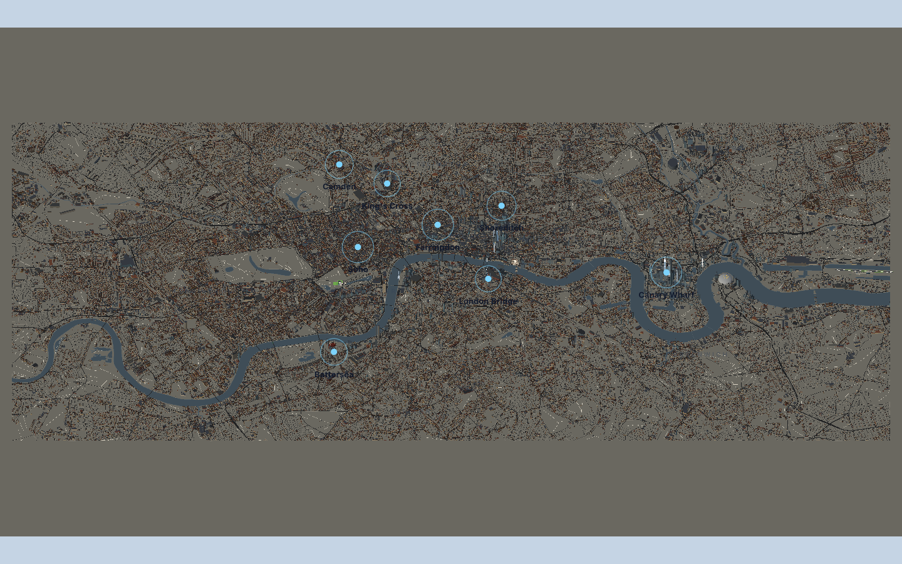

# Shared road pages: native browser comparison

Candidate `0e3a31442f4a4bfd775f70d9a29ba07e5b4ae10e` versus
`6e1fcb1fc8b34788805199148545e554a91a4c74`. Draw-call reduction is measured;
wide startup and draw-call acceptance still fail.

## Evidence

- [Full report](https://app.devin.ai/attachments/04cf862c-4ef2-4d93-96a3-ff1c477e6c5d/result.md)
- [Complete bundle: raw observations, 54 screenshots and cleanup](https://app.devin.ai/attachments/11328139-d7c0-45c7-ba56-caa36b5cf947/evidence.zip)
- [Compact measurements](browser-pages-0e3a314/final-measurements.json)
- [Cleanup](browser-pages-0e3a314/cleanup.json)
- [Visual/game recording](https://app.devin.ai/attachments/13fd40b1-83bb-4b14-95a3-277907118101/runway-pages-visual-game-edited.mp4)
- [Timing recording](https://app.devin.ai/attachments/7de0a6ff-b050-45f8-8d59-6671d4e7fc39/runway-pages-native-edited.mp4)

| Baseline, matched overview | Candidate, matched overview |
| --- | --- |
|  |  |

## Conditions

Visible Chrome 153.0.8010.48, native ANGLE Metal/Apple Paravirtual device;
1440×900 DPR 1. Independent frozen installs and sequential production builds
before measurement. A fresh process/profile per pair and cleared/disabled
HTTP cache do not reset OS/driver/compiler/shader caches. Reload shares
process/JIT/GPU state. No parent build or CPU probe overlapped measurement.

Candidate build `bZ44S-RojE17U8WjcoNo0`; baseline build
`-NkUmz2TDeg09WHMIiv84`. Production `/game?qa=1&view=wide` for wide samples;
omit `view=wide` for the candidate-only default regression pair.

## Every startup observation

Milliseconds to actual useful 3D. No discarded samples; all ten rendered
useful city within the 60-second cap.

| Observation | Baseline | Candidate |
| --- | ---: | ---: |
| Wide 1 cold | 14,958.1 | 13,475.4 |
| Wide 1 reload | 12,961.7 | 12,916.4 |
| Wide 2 cold | 15,091.0 | 13,873.3 |
| Wide 2 reload | 15,339.4 | 13,261.0 |
| Default cold | Not requested | 4,933.7 |
| Default reload | Not requested | 4,112.5 |

All eight wide observations fail ≤5 seconds. Wide cold medians are
15,024.55→13,674.35 ms and reload medians 14,150.55→13,088.70 ms.
Lower candidate medians are suggestive; two pairs do not establish dependable
causal startup improvement. The default pair passes, but does not establish
repeatability or erase earlier failures.

## Matched settled views

Triangles and geometry bytes match exactly at each angle.

| Look / azimuth | Calls, baseline→candidate | Triangles, both | Geometry bytes, both |
| --- | ---: | ---: | ---: |
| zero / 0 | 2,817→2,390 (−15.16%) | 1,908,689 | 130,812,722 |
| stpauls / 0.72 | 2,774→2,351 (−15.25%) | 1,889,114 | 130,812,722 |
| eye / −π/2 | 2,551→2,148 (−15.80%) | 1,817,927 | 126,393,623 |

Every candidate angle passes 128 MiB and two million triangles but fails
300 calls. Thirty-second held pan has 1,800 rAF intervals and p95 19.7 ms,
within 33 ms. The measured call reduction agrees with the source-page change;
it is accepted as a bounded improvement, not release readiness.

## Focused regressions and limits

Fitzrovia→Shoreditch→overview, close zoom, asphalt/pavement/markings,
Blackfriars crossing/water, Residence pick/card/beam, save/reload/Continue and
playable context-loss fallback pass. No new seam/disappearance/order defect
was identified in the bounded inspection. Close bridge views were
candidate-only. The save is 1,511 characters / 1,512 UTF-8 bytes; the recording
annotation incorrectly labels the character count as bytes.

One 390×844 DPR 2/coarse-touch default sample passes at 4,800 ms. This is
emulation, not physical-device validation. Sixteen `/favicon.ico` 404s remain;
no captured page errors, crashes or harness errors. Passive road-context
completion is unavailable for both default samples; cover-index completion
is unavailable for baseline wide cold 1. Missing values are not zero and
elapsed stages are not exclusive CPU.

Historical startup/mobile and paired SwiftShader failures remain preserved;
software controls were not rerun. Physical Safari, formal street fidelity,
GPU execution cost and physical driver-memory reclamation remain unverified.
All owned processes and recordings stopped; no tracked application edits.

## Next bounded work

Shared road tails cannot remove the dominant one-mesh-per-stock-cell cost.
An isolated worker will implement overview stock pages over the existing 400m
source cells, with exact geometry/picks and atomic tile/cell transitions.
This is not yet accepted or integrated. The 128 MiB, 300-call and startup
targets remain unchanged; further residual costs will still require evidence.
