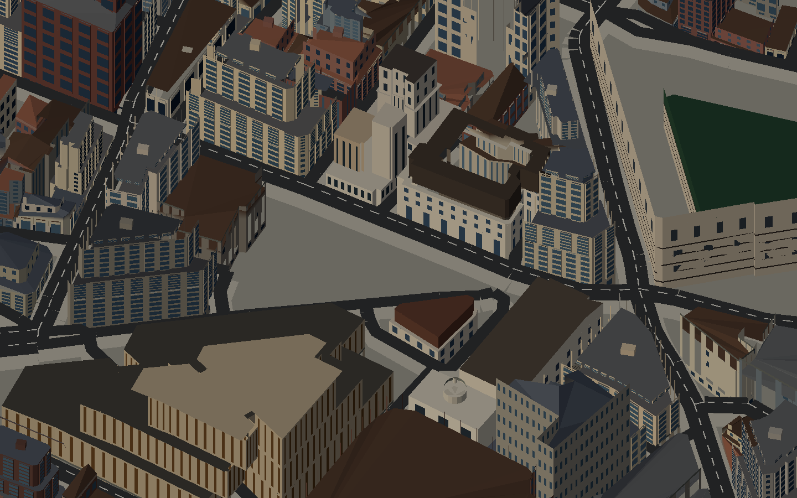
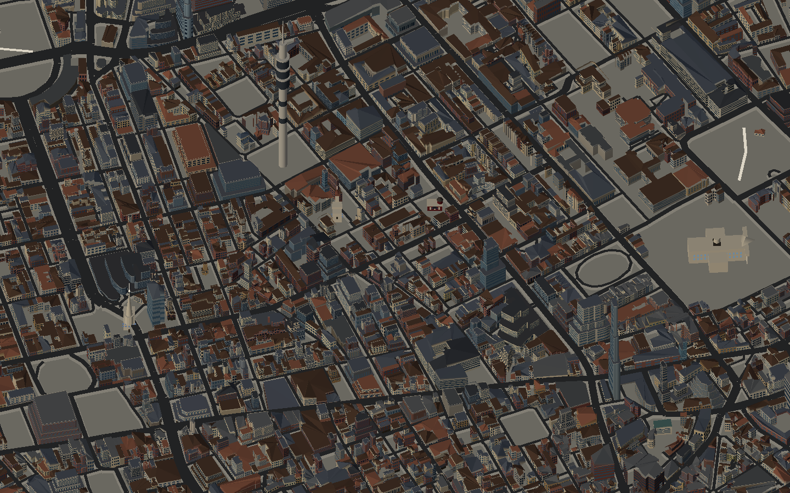

# Planning baseline evidence

Audited source: `4f76b634c2ae1201d939fa3ccff12f4724624b94`, PR #27. Captured on 5 September 2026 before runtime changes; this planning branch only adds documentation. All results below were independently obtained in this session. Saved command logs normalize whitespace and replace the local worktree path.

Environment: Apple M1 / macOS arm64; Node 26.5.0; pnpm 10.33.0; production Next.js server at `http://127.0.0.1:4317`; isolated headless Chrome for Testing 150.0.7871.24, SwiftShader (`--use-angle=swiftshader --enable-unsafe-swiftshader`), 1440×900, DPR 1. This is a diagnostic environment, not an accepted real-device performance benchmark.

## Code and data checks

| Check                                        | Result | Evidence                                                                                         |
| -------------------------------------------- | ------ | ------------------------------------------------------------------------------------------------ |
| `pnpm install --frozen-lockfile`             | PASS   | Lockfile unchanged; 368 packages installed.                                                      |
| `pnpm test:game`                             | PASS   | [Log](test-game.log): 13 engine + 20 OSM/UV + 22 noticed + 16 landmark + 40 street checks = 111. |
| `pnpm test:ui`                               | PASS   | [Log](test-ui.log): 8 SSR checks.                                                                |
| `pnpm lint`                                  | PASS   | [Log](lint.log): exit 0.                                                                         |
| `pnpm build`                                 | PASS   | [Log](build.log): production compile, types and prerender succeeded.                             |
| `pnpm tsx scripts/fetch-geodata.ts --verify` | PASS   | Decode-only: 113,569 buildings; 56,793 roads; 769 parks; 62 water polygons; 6,698,590 bytes.     |

No gameplay, renderer, dependency or generated map asset was changed for these results.

## Browser observations

- `/game?map=3d&look=citystreet&chrome=0` painted stock buildings and roads, reached `data-map-ready=1`, and painted after reload. The captured citystreet resource entries showed the binary and noticed manifest, with no Poultry GLB request.
- `/game?map=3d&view=mid&chrome=0` painted neighbourhood stock and roads, reached the ready attribute, and was captured again after reload.
- No Aw Snap page was seen during these observed loads/reloads. This does **not** disprove the older failure on a different environment or establish sustained stability.
- The browser session recorded **React error #418**. [Stored error](browser-errors.json); [official meaning](https://react.dev/errors/418): server/client hydration mismatch. R2 must confirm and fix its source.
- Visual observations: street and mid frames are populated but dark, with dense repeated facade lines and visible large unbuilt/excluded areas. They are baseline screenshots, not approved SFSIM reference images. The map's quality needs the G2 comparison.
- Default `/game`, wide view, the full hub tour, real mobile, forced failures, CPU/GPU resource budgets, and full game/offline browser flows were **not verified in this planning audit**. R0/G1/G4 explicitly cover them. Runs overlapped other code checks, so no credible frame-time or load-time benchmark is claimed here.

## Captures

Reload evidence: [Cheapside](citystreet-reload.png), [mid view](mid-reload.png).

## SHA-256 of captured images

- `citystreet.png`: `f45849df394b756dcb02b44ab4b3320b45f10a52c146b64dbb2d76e493aa593f`
- `citystreet-reload.png`: `f45849df394b756dcb02b44ab4b3320b45f10a52c146b64dbb2d76e493aa593f`
- `mid.png`: `debbcbac3207074f726b6ee6593a6b69c82c85cbb7167b69756342760f0d7df8`
- `mid-reload.png`: `debbcbac3207074f726b6ee6593a6b69c82c85cbb7167b69756342760f0d7df8`
