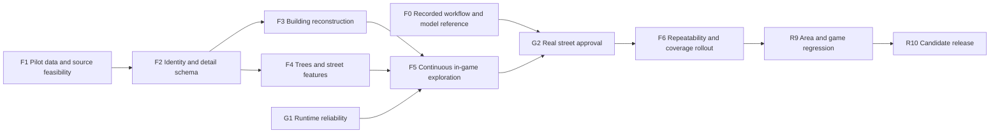

# Faithful London Reconstruction Implementation Plan

> **For agentic workers:** REQUIRED SUB-SKILL: Use superpowers:subagent-driven-development (recommended) or superpowers:executing-plans to implement this plan task-by-task. Steps use checkbox (`- [ ]`) syntax for tracking. External workers can use the repository's equivalent [worker/reviewer contract](../../runway-recovery/agent-contract.md).

**Goal:** Reproduce actual London streets and buildings at the owner's selected SFSIM visual standard, with recognizable individual trees, signs and street features.

**Architecture:** Follow the supplied address → reference photos → physical-feature description → model workflow. Match each building to real geography, review its instance brief, generate/bake geometry with Blender and reusable kits, then load accepted cell assets through the reliable Three.js renderer. Prove a complete ordinary street and a second contrasting area before expanding coverage.

**Tech Stack:** Existing Next.js/React/TypeScript/Three.js app and pnpm; offline OSM/reference processing; current bake tooling, with any additional data/imagery/model service chosen only after an evidence/cost review.

**Spec:** [Product P1–P12](../../runway-recovery/product.md), [fidelity contracts C6–C7](../../runway-recovery/fidelity.md), [runtime C1–C5](../../runway-recovery/architecture.md), [runtime plan](2026-09-05-runway-recovery.md).

## Global constraints

- Map/rendering and offline city reconstruction only; preserve game rules, balance, content, RNG, audio rules, save schema and action semantics.
- Three.js stays behind the dynamic factory boundary; no browser/WebGL side effects in SSR.
- New detail is based on traceable observations; inferred features stay identified as inferred. No random filler can pass as a real tree, sign or frontage.
- Existing bbox/binary stay fixed during R0–R6. F2 may add pilot sidecars/assets; preprocessing/codec changes need their own assigned and verified task.
- Keep same-origin play-time assets, automatic 2D fallback and separation from `londonstartupmap.com`.
- Every code/asset gate runs `pnpm test:game`, `pnpm test:ui`, `pnpm lint`, `pnpm build` and its focused checks. Data-pipeline changes also regenerate/verify affected committed data as required by `AGENTS.md`.
- No reconstruction worker has started in this planning PR. These cards define future assignments, not completed capabilities.

## Dependencies and dispatch



R0 and F1 can start independently. F0's workflow and static model-detail brief is now recorded from the owner-supplied screenshot; unseen SF camera motion is explicitly unverified. F3 and F4 can run in parallel only with disjoint asset recipes and one manifest integrator. Each F3/F4 worker gets one specific building or object family and a filled source/feature brief; never an open request to recreate an entire borough.

## F0 — Record the exact SFSIM reference

**Owner:** tech lead / visual reviewer. **Input:** owner's two post URLs and supplied screenshot. **Allowed files:** `docs/runway-recovery/evidence/F0/reference.md` and the unchanged reference image. No code or speculative tool setup.

**Recorded evidence:** [F0 reference brief and artifact](../../runway-recovery/evidence/F0/reference.md). This is reference capture, not acceptance of any London implementation.

- [x] Inspect Foo's supplied screenshot after direct post access failed. Preserve the unchanged image and its hash; record that the crop does not contain a status URL.
- [x] Record the creator's stated address/photo/physical-feature/Blender workflow and separate these statements from independently verified pipeline behavior. Exa and Devin are visible in the supplied text.
- [x] Describe the four photograph/model pairs, their distinguishing geometry/material features and the London worker implications. Timestamps are not applicable to this still image.
- [x] Record that selected detailed buildings and creator-reported scene counts do not establish every-building/tree/sign accuracy. Exact SF projection, controls, movement and performance are not visible.
- [x] Preserve the source and a reproducible brief; map the workflow to bounded London worker stages. No new style decision or additional owner input is needed for this reference-capture scope.

**Acceptance:** another reviewer can inspect the saved screenshot and reproduce the workflow/static-detail description. Motion footage, if later supplied, adds evidence rather than blocking the use of this owner-selected static benchmark. G2 still judges the actual continuous London pilot against the owner's full requirement.

## F1 — Prove pilot source coverage before building assets

**Owner:** geodata/reference worker, reviewed by tech lead. **Input:** public street nominated by Foo, otherwise Charlotte Street in Fitzrovia as a candidate. **Allowed files:** `docs/runway-recovery/evidence/F1/`, new `scripts/audit-street-sources.ts`, local source caches outside shipped assets. No whole-city refetch or renderer changes.

**Resume point:** [initial F1 checkpoint](../../runway-recovery/evidence/F1/feasibility.md). The map route, two contrasting frontage candidates and a rejected image match are recorded. Full inventory/coverage, metric control points and the GO decision remain pending; do not treat this checkpoint as a completed source package.

- [ ] Fix a 200–300 m continuous segment only after mapping actual junctions and reference availability. Record its exact bbox/endpoints and a walking-direction route; include both street sides and a junction. Do not use guessed house-level coordinates.
- [ ] Inventory every street-facing building and salient tree/sign/lamp/crossing along the route. Record source IDs, geometry, date, evidence links, rights/use basis, observed fields, inferred fields and missing fields. The inventory is complete even when information is missing.
- [ ] Query the bounded source area: OSM footprints/parts/paths/trees, candidate GLA tree records and height/surface evidence. Recover stable source feature IDs. Evaluate geolocated facade imagery with concrete sample coverage; do not assume Wikipedia covers ordinary frontages.
- [ ] Exercise the demonstrated address-to-reference step on two contrasting ordinary buildings. Match each address/ID to the correct footprint and photographs, then produce a physical-feature brief with source views for silhouette, storeys, roof, facade rhythm, material and standout details. A search result or nearest photo alone is not a verified building match.
- [ ] Produce a coverage table: footprint/height/roof/facade/tree/sign evidence per entity. Record source CRS and transforms to the game's world coordinates. Inspect age and alignment against at least three distinct control points.
- [ ] Prepare two feasible acquisition/enrichment options if the imagery gap remains, with specific samples, use constraints, human/agent effort and monetary costs. Do all read-only/free feasibility work before asking for any paid setup.
- [ ] Commit a GO/NO-GO report and exact source package. GO requires credible evidence for the full pilot route and its salient features. Missing evidence cannot be replaced with randomized detail; propose a better-covered pilot or a bounded collection task.

**Acceptance:** the tech lead can supply source-backed entity packets to workers and explain how the source observations could meet P2/P10. No promise of London-wide coverage or cost based solely on the existence of a dataset.

## F2 — Preserve source identity and validate a detail sidecar

**Owner:** compact data worker. **Depends:** F1 GO. **Allowed files:** new `lib/game/cityDetail.ts`, new `scripts/test-city-detail.ts`, new `scripts/prepare-street-detail.ts`, `data/city-detail/pilot/`, new `public/map/detail/manifest.json`. Any change to `scripts/fetch-geodata.ts` or `render3d/format.ts` is a separate follow-up packet.

**Interfaces:** C6 `DetailArea`, `StreetEntity`, `BakedDetailTile`, `validateDetailArea(area): string[]`, `encodeDetailArea(area): string`.

- [ ] Implement C6's pure schema/validator with stable IDs and deterministic encoding. Tests must reject duplicate IDs, missing source references, invalid lat/lon, `observed` values without evidence and `unknown` values with fabricated non-null data.
- [ ] Include this minimum truthfulness example in the focused test:

```ts
const point = {
  value: { longitude: -0.1358, latitude: 51.5196 },
  state: 'observed' as const,
  sourceIds: [],
};
// A StreetEntity using point must fail validation: no observation source.
// Do not use this synthetic coordinate as evidence of a real tree or sign.
```

- [ ] Convert the actual F1 source package to the sidecar. Use original OSM/provider feature IDs, never old binary array offsets as identity. Store uncertain spatial joins for review; no automatic many-to-one stock suppression.
- [ ] Add deterministic round-trip/ordering and coordinate-transform tests using the actual control points. Keep original schema fixtures so later regeneration can be compared.
- [ ] Run `pnpm tsx scripts/test-city-detail.ts` and required gates. Store processed data provenance; do not commit reference imagery without the recorded right to do so.

**Acceptance:** a fresh agent can trace every observed pilot field to an inspected source and reproduce the same sidecar from its pinned inputs. Current binary remains usable as a baseline/fallback.

## F3 — Reconstruct ordinary buildings from instance evidence

**Owner:** one asset worker per bounded building/recipe packet; capable reviewer handles ambiguous geometry. **Depends:** F2 and the recorded F0 brief. **Allowed files:** new `scripts/city-detail/buildings/pilot-frontage.ts`, new `scripts/bake-city-detail.ts`, new `scripts/blender_city_detail.py`, one pilot entity/asset entry, generated `public/map/detail/pilot/` assets, new `scripts/test-detail-buildings.ts`. The first worker owns the shared bake entry points; later batches receive their own exact recipe paths and entity IDs and must not edit those shared files concurrently.

- [ ] Start with two contrasting ordinary buildings from the preselected inventory. Each packet contains actual footprint/height/roof observations, facade orientation, storeys/bays/openings, materials, entrance/storefront and distinct shape features, with source IDs and unknowns.
- [ ] Inspect the job/export conventions in `scripts/bake-noticed.ts` and `scripts/blender_noticed.py`. For the first distinctive building, implement a deterministic Blender recipe in the new pilot files using the approved feature brief. Preserve actual silhouette, roof, voids, facade rhythm and standout geometry demonstrated by F0. Reuse suitable primitives/export helpers without rebaking existing heroes or rewriting the runtime.
- [ ] Implement reusable operations for walls, openings, bays and roofs using the reviewed instance parameters. A model may propose features from imagery; the reviewer verifies them before marking observed. The existing Three.js baker may supply already-verified shared primitives, with the same per-building visual acceptance.
- [ ] Persist the approved brief, recipe version, input hashes, Blender version and regeneration command. The proposed offline call is `blender --background --python scripts/blender_city_detail.py -- <assigned-job.json>`; the tech lead supplies the actual job path in each packet. A clean rerun must reproduce geometry/metrics; GLB container-byte differences, if any, must be explained rather than mistaken for shape drift.
- [ ] Bake a bounded GLB plus C6 metrics/hash. Validate that footprint bounds, height, front orientation and observed opening counts match the source record. Check a second viewpoint so a photo pasted on a box cannot substitute for 3D shape.
- [ ] A generic kit is acceptable only when that instance matches its actual reference. Features the kit cannot represent require a bounded recipe extension, not a generic approximation marked complete.
- [ ] Repeat in small batches covering every pilot frontage. Record manual corrections and cost per accepted building; a new worker must be able to use the recipe with another entity record.
- [ ] Run focused geometry and required gates; add before/reference/after captures. Real-world scale takes priority over the old runtime's tower/height exaggeration inside the faithful pilot.

**Acceptance:** preselected ordinary buildings are recognizable from their distinguishing source-backed shape and facade features. Names, occupant research, interiors and individual window-interior contents are unnecessary.

## F4 — Place actual trees and salient street objects

**Owner:** vegetation/streetscape worker with disjoint files from F3. **Depends:** F2. **Allowed files:** new `scripts/city-detail/street-objects.ts`, its assigned source records, generated pilot object assets and manifest entries, new `scripts/test-detail-objects.ts`.

- [ ] Consume observed positions/orientations from F1/F2. Join tree inventory records to current reference views; retain date/uncertainty when size or canopy is unobserved. Do not identify the tree from nearest-point matching alone if the match is ambiguous.
- [ ] Build reusable tree forms and object kits. Per-instance coordinates, scale, species/form, heading, sign dimensions/colour and visible salient text/design come from the record. Detailed branches/leaves are not required unless they materially affect reference resemblance.
- [ ] Verify local coordinate conversion, street side, orientation and dimensions. Test that unknown locations do not generate “observed” objects and that regeneration preserves source identity.
- [ ] Disable decorative random trees/lamps/signs within the accepted pilot detail area while its observed layer is active; coordinate this integration with F5's sole runtime owner. Do not create two overlapping layers.
- [ ] Capture the preselected small-object comparisons and whole-street context; run focused and required gates. Record source gaps as blockers for salient objects, not a reason to sprinkle plausible replacements.

**Acceptance:** the route's distinctive real tree/sign/object instances are placed and represented faithfully. Shared meshes keep the runtime economical; procedural placement does not establish truth.

## F5 — Integrate a continuous close street tour and G2 evidence

**Owner:** runtime integrator / tech lead. **Depends:** F3, F4 and runtime G1. **Allowed files:** `lib/game/render3d/CityRenderer3D.ts`, new `lib/game/render3d/detailTiles.ts`, new `lib/game/render3d/streetCameraRig.ts`, additive visual types in `lib/game/scene.ts`, `components/game/MapCanvas.tsx`, browser fixtures. No engine changes.

- [ ] Load versioned pilot tile assets through C1–C5 ownership, scheduling and eviction. Map accepted enriched footprints to their exact base replacements; ordinary stock stays when assets fail. Place detail with actual scale; blend LOD without duplicate footprints or random furniture.
- [ ] Demonstrate a street-facing close exploration camera and a pedestrian-eye-height variant. The legacy 48-degree orthographic camera remains the game overview while the comparison is evaluated; it cannot be used to rule out the street-level requirement. Keep map marker projection, focus and fallback behavior compatible.
- [ ] Use a deterministic geolocated route for repeatable motion. Proposed visual-only type in `scene.ts`:

```ts
export interface StreetViewPose {
  x: number;
  y: number; // existing ground/world convention
  eyeHeightM: number;
  headingRad: number;
}
```

- [ ] Record a continuous 200–300 m traversal in both directions in `/game`, plus ten building and observed-object comparisons from C7. Do not substitute an isolated mesh viewer or montage. Test pan/look/search/return-to-game and touch controls.
- [ ] Profile geometry and texture memory, asset transport, frame time and repeat-tour cleanup. Pilot detail may change asset budgets only after a recorded engineering review, never by hiding unknown coverage or lowering the visual bar.
- [ ] Apply the C7 recognition checklist with a reviewer familiar with the public area and Foo's comparison against the saved F0 model pairs. Prove close exploration in the actual London route. Do not claim to match unseen SF camera behavior or to have verified its complete street scene.

**Acceptance:** G2 requires both faithful place representation and stable runtime. A recognizable skyline, a generic attractive street, or screenshots from just one angle are insufficient.

## F6 — Prove the pipeline can scale beyond the pilot

**Owner:** tech lead, source worker and independent reviewer. **Depends:** G2. **Allowed files:** a second named area's source/detail package and asset recipes through bounded worker cards, coverage/cost reports and rollout plan. Core changes require their normal ownership/review lane.

- [ ] Select a contrasting ordinary area with verified sources. Repeat F1–F5 using the same schemas and reusable recipes, recording any required exceptions. Do not start with another famous landmark cluster.
- [ ] Compare source coverage, correction rate, person/agent hours, model/API/bake cost, asset bytes, visible quality and runtime budgets to the first area.
- [ ] Produce an explicit London coverage map and staged delivery estimate based on these measurements. Name the intended final geographic boundary, reference-device support, reference-data refresh policy and unresolved imagery gaps.
- [ ] Give Foo a concrete scope/cost choice if the desired coverage requires additional paid sources or substantial collection work. The pilot is evidence for that decision, not a substitute for the stated city ambition.
- [ ] Expand accepted areas in bounded batches and feed them to R9/R10 for regression/release review. Do not label a whole borough or all London faithful because a few selected streets passed.

**Acceptance:** a second ordinary area meets the same recognition bar with a repeatable, costed process; the remaining city rollout has defensible inputs and explicit coverage limits.
