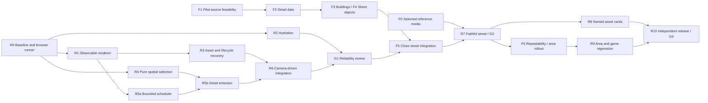

# RUNWAY London Map Recovery Implementation Plan

> **For agentic workers:** REQUIRED SUB-SKILL: Use superpowers:subagent-driven-development (recommended) or superpowers:executing-plans to implement this plan task-by-task. Steps use checkbox (`- [ ]`) syntax for tracking. If these skills are unavailable to an external worker, the orchestrator supplies the equivalent bounded worker/reviewer workflow from the agent contract. This plan does not require every worker to be an orchestrator.

**Goal:** Supply the reliable runtime and integration gates for a faithful, explorable London reconstruction at the owner-selected SFSIM benchmark, preserving the RUNWAY game.

**Architecture:** Preserve the game, shared overlay and renderer interface while recovering runtime reliability. The parallel [fidelity plan](2026-09-05-london-fidelity.md) supplies real building/facade/object evidence and enriched assets; both tracks must pass before street-recognition approval and area rollout.

**Tech Stack:** Next.js 16.2.6, React 19.2.4, TypeScript, Three.js 0.185.1 from the current lockfile, Tailwind 4, pnpm; a development-only browser test runner added by R0.

**Spec:** [Product contract](../../runway-recovery/product.md), [architecture contracts C1–C5](../../runway-recovery/architecture.md), [verification](../../runway-recovery/verification.md), [worker/reviewer contract](../../runway-recovery/agent-contract.md), [fidelity C6–C7](../../runway-recovery/fidelity.md) and [reconstruction tasks F0–F6](2026-09-05-london-fidelity.md).

## Global constraints

- Map/rendering recovery only; no engine, balance, content, RNG, audio rules, save-schema or modal-action changes.
- Preserve `Scene`, `HitTarget`, the shared overlay and `IMapRenderer` behavior. Additive diagnostic types are allowed when explicitly assigned.
- Three.js must remain behind the existing dynamic factory boundary. Keep SSR free of browser/WebGL side effects.
- Freeze the current bbox/binary during R0–R6. F2 may add versioned pilot detail assets and separately assigned preprocessing changes; spatial expansion follows repeatable quality evidence. Never invent missing neighbourhoods.
- Keep automatic 2D fallback. Earlier specs asking to delete it are superseded for this effort.
- Keep `londonstartupmap.com` separate. Product approval is required before attaching or deploying this app there.
- Each acceptance gate runs `pnpm test:game`, `pnpm test:ui`, `pnpm lint`, `pnpm build`, plus the focused tests/browser views in its card. Workers do not self-approve.
- No build execution has started in this planning PR. R0 is the first runtime task; the independent F1 source audit can also start. F0 reference inspection waits for accessible media. Earlier passing command results are evidence to use, not permission to skip a fresh execution baseline.

## Dependency and ownership map



R2 and pure R4 may run alongside R1 when file ownership is disjoint. R3, R5b and R6 each modify runtime hot spots and run sequentially. R8 assets may be parallel only after separate recipes/manifests have one integration owner. Do not parallelize by having multiple workers edit `lib/game/render3d/cityBuilder.ts`.

The IDs describe reviewable work, not time estimates. R3 and R5 have sub-cards to keep smaller workers' assignments bounded. The tech lead dispatches only dependency-ready sub-cards, on exact SHAs, with explicit allowed files. If a change cannot fit its contract, revise the card before dispatch; do not improvise cross-cutting architecture inside the worker turn.

## R0 — Record the baseline and make browser failures reproducible

**Owner:** tech lead + QA worker. **Depends:** planning commit. **Produces:** G0 evidence and a repeatable failing/passing browser report. **Allowed files:** `package.json`, `pnpm-lock.yaml`, new `scripts/test-map-browser.mjs`, new `scripts/map-browser-fixtures.mjs`, `docs/runway-recovery/evidence/R0/`, `docs/runway-recovery/status.md`. No renderer changes.

- [ ] Verify the plan SHA and #27 baseline from the audit; create the isolated execution branch and record the lockfile/tool versions. Use current saved baseline results to identify likely failures.
- [ ] Pin `@playwright/test` as a dev dependency and install Chromium; create `test:map:browser` with `node scripts/test-map-browser.mjs`. Select installed package versions at execution and commit the resolved lockfile; do not upgrade the app dependencies.
- [ ] Implement the runner's minimal observation loop below. Add separate browser contexts for B1–B5/B8, both viewport fixtures, and reloads. Store errors/screenshots even when a case fails. Fail the process after collecting results if any case failed; do not abort before preserving the evidence.

```js
import { chromium } from '@playwright/test';
const baseURL = process.env.RUNWAY_BASE_URL ?? 'http://127.0.0.1:4317';
const browser = await chromium.launch();
const context = await browser.newContext({ viewport: { width: 1440, height: 900 } });
const page = await context.newPage();
const errors = [];
page.on('pageerror', (error) => errors.push(error.message));
page.on('crash', () => errors.push('page crashed'));
await page.goto(`${baseURL}/game?map=3d&look=citystreet&chrome=0`);
await page.locator('[data-map-ready="1"]').waitFor({ timeout: 30000 });
await page.screenshot({ path: 'docs/runway-recovery/evidence/R0/citystreet.png' });
// Store errors, URL, viewport, browser.version() and the tested SHA in result.json.
// R1 adds authoritative renderer-mode/state assertions to this observation.
await context.close();
await browser.close();
if (errors.length) throw new Error(errors.join('\n'));
```

- [ ] Run the required commands on the actual worktree, the browser matrix, a 30-second pan trace and an all-hub navigation observation. Record crashes, hydration errors, readiness timing and missing coverage independently. Capture available resource counters; unknown metrics are explicitly unmeasured.
- [ ] Compare the pinned head with prior candidates only if a current failure calls for it. Use exact commits `fcec93d...` (#26) and `38076383aa...` (historical HOLD); neither is pre-approved. Do not silently rebuild from an unavailable historical commit.
- [ ] Publish G0's defect list, named hardware, proposed-budget calibration and first two runtime packets. Commit the runner/evidence. A red browser baseline is an expected **finding**, not a failed audit or permission to change thresholds.

**Acceptance:** another agent can start the local production server and run one command to reproduce the baseline results with captured artifacts. G0 does not approve visual quality or release.

## R1 — Expose actual renderer state and costs

**Owner:** runtime worker. **Depends:** R0. **Allowed files:** new `lib/game/mapDiagnostics.ts`, new `lib/game/render3d/diagnostics.ts`, `lib/game/render3d/CityRenderer3D.ts`, `components/game/MapCanvas.tsx`, new `scripts/test-map-diagnostics.ts`, browser runner. **Interfaces:** consume existing `IMapRenderer` and queue state; produce C1 `MapDiagnostics` and read-only `MapQaBridge`.

- [ ] Add C1's exact types. Implement the debug reporter and an optional callback from 3D/2D lifecycle to `MapCanvas`; do not expose Three.js objects through the bridge.
- [ ] Count job completion/failure, active mode, geometry bytes, render counters and first useful frame. Bounded error history keeps the latest 20 errors plus a total count. Do not perform a scene traversal every frame.
- [ ] Add focused tests for state transitions and unique-buffer accounting; then assert in browser QA that forced 3D actually reports `mode: '3d'` and essential failures never report ready.

```ts
// Required observable cases in test-map-diagnostics.ts:
// loading + successful essential frame -> ready
// optional failed job + successful essential frame -> degraded
// essential failed job -> fallback (never ready)
// same buffer referenced by two meshes -> bytes counted once
// generation disposed -> no later callback can change its state
```

- [ ] Record B1–B3 diagnostic snapshots before/after. Run required gates. Commit and submit the packet; geometry and asset shapes must be unchanged.

**Acceptance:** readiness/mode are distinguishable, errors have stable job IDs, metrics have documented meaning, and the debug bridge is absent without `qa=1`.

## R2 — Fix the independently observed hydration error

**Owner:** compact UI worker. **Depends:** R0. **Allowed files:** `components/game/CityHud.tsx`, `scripts/test-ui.tsx`, browser runner/fixtures. **Interfaces:** preserve `CityHud` props, `londonClock(Date)`, `londonClimate(Date)` and search callbacks.

- [ ] Reproduce React #418 with the production build, a fixed server render and a different client clock. Confirm the differing element before editing; `new Date()` in the HUD is a hypothesis with direct source evidence.
- [ ] Make the server and initial client snapshot identical. The existing `useSyncExternalStore` pattern in `GameApp` is the model: subscribe to a 30-second clock update; use an initially empty/neutral server clock and render real time only after hydration. Keep hooks unconditional even when `hide` is true.
- [ ] Keep the city search and game flow unchanged. If keeping the monthly climate display, label it as typical monthly conditions so it is not mistaken for live weather/AQI; no new data calls.
- [ ] Add a real hydration regression to the browser runner (including `chrome=0`, visible chrome, a reload and a clock rollover). The existing SSR markup check alone cannot prove this fix.
- [ ] Run focused and required checks; submit matching screenshots and empty hydration-error logs.

**Acceptance:** no #418 across the test cases; clock updates after mount; HUD search and server rendering work.

## R3a — Make resources and late loading owned and cancellable

**Owner:** runtime worker. **Depends:** R1. **Allowed files:** new `lib/game/render3d/sceneResources.ts`, `lib/game/render3d/CityRenderer3D.ts`, `lib/game/render3d/landmarkPrefabs.ts`, `lib/game/render3d/noticedPrefabs.ts`, new `scripts/test-scene-resources.ts`, browser runner. All renderer module paths are under `lib/game/render3d/`.

**Interface:** `createResourcePool()` produces `{ retain(resource: { dispose(): void }): () => void; dispose(): void }`; each returned release is idempotent, shared resources are disposed once after final release, and pool disposal disposes all remaining resources once. The renderer owns generation IDs, pending jobs and loader cancellation.

- [ ] Write the ownership example below, implement the pool and confirm it passes.

```ts
let disposed = 0;
const resource = {
  dispose: () => {
    disposed += 1;
  },
};
const pool = createResourcePool();
const releaseA = pool.retain(resource);
const releaseB = pool.retain(resource);
releaseA();
releaseA();
assert.equal(disposed, 0);
releaseB();
pool.dispose();
assert.equal(disposed, 1);
```

- [ ] Integrate ownership for geometry, material textures, prefab sources and clones. Mark the generation disposed before aborting/clearing work; a late resolved GLB must be released without attaching or firing ready.
- [ ] Test rapid mount/unmount, context loss during loading, and delayed asset completion. Check handlers/queues/pick references as well as GPU objects. Do not rebake or change asset appearance.
- [ ] Run required gates and the repeated-tour resource check; submit exact counts and any unmeasured browser overhead.

**Acceptance:** no obsolete generation mutates the scene; shared assets survive another clone's removal; renderer teardown releases its owned resources once.

## R3b — Restore stock when a replacement is unavailable

**Owner:** same runtime lane after R3a. **Depends:** R1, R3a. **Allowed files:** `lib/game/render3d/noticedPrefabs.ts`, `lib/game/render3d/landmarkPrefabs.ts`, `lib/game/render3d/uniqueStreet.ts`, `lib/game/render3d/cityBuilder.ts`, `lib/game/render3d/CityRenderer3D.ts`, `scripts/test-noticed.ts`, `scripts/test-city-read.ts`, browser fixtures.

- [ ] Change exclusion planning to use the set of active available replacements, not every manifest entry or hardcoded unique pin. Make the selection a pure helper with input `{ id, available, enabled }[]` and output the active replacement IDs.
- [ ] Test three cases: enabled+available suppresses only its own stock; disabled or failed does not suppress; a neighbouring building is never suppressed by a replacement's broad default radius without an approved footprint mapping.
- [ ] Restore ordinary OSM massing at Poultry while keeping `shouldLoadNoticedGlb('no-1-poultry', false) === false`. Remove the test assumption that a deliberate hole is acceptable; replace it with a coverage assertion plus the no-fetch invariant.
- [ ] Record optional failure details and escalate essential layer failures to fallback. Re-shoot B2/B3/B10/B11; run required gates. Do not change Poultry's unique mesh, heroes, keep radius or visual style.

**Acceptance:** optional failures degrade gracefully, Poultry has stock massing, and failed essential work cannot drain into a successful empty map.

## R4 — Index city data and select visible coverage without rendering

**Owner:** compact pure-helper worker. **Depends:** R0. **Allowed files:** new `lib/game/render3d/cityIndex.ts`, new `lib/game/render3d/coverage.ts`, new `scripts/test-city-coverage.ts`. **Interfaces:** C3 exact `indexCity`, `cellsForBounds`, `coverageDelta`, `CityCell`, `BoundsXZ` and `CellId`.

- [ ] Implement the index from the existing `CityData` type. Group each building once by centroid at 400 m, extend owner-cell bounds to its footprint, sort output. Never mutate decoded data.
- [ ] Add boundary, negative-coordinate, empty-scene and deterministic-output fixtures. Use this delta behavior as a minimum example:

```ts
assert.deepEqual(coverageDelta(new Set<CellId>(['0,0', '1,0']), ['1,0', '2,0']), {
  add: ['2,0'],
  keep: ['1,0'],
  remove: ['0,0'],
});
```

- [ ] Decode the committed binary and assert each original building index appears in exactly one owner cell; selection includes a cell whose footprint bounds overlap even when its centroid lies outside the view.
- [ ] Run `pnpm tsx scripts/test-city-coverage.ts` and required gates. Include index construction time and counts; do not claim this proves rendered performance.

**Acceptance:** stable, no-duplicate selection that the runtime can consume. No Three.js or DOM dependency in these helpers.

## R5a — Introduce a bounded, measurable scheduler

**Owner:** pure-helper worker. **Depends:** R1. **Allowed files:** new `lib/game/render3d/buildScheduler.ts`, new `scripts/test-build-scheduler.ts`. **Interfaces:** C4 `BuildJob`, `BuildScheduler`, `DrainResult`, `createBuildScheduler`.

- [ ] Use a queue preserving essential-visible priority supplied by the caller. Drain until the injected clock reaches `budgetMs`; retain incomplete jobs for the next frame and record failures by ID/essential flag.
- [ ] With a fake clock, test that three jobs each consuming 3 ms cannot all run inside a 4 ms drain; preserve remaining work for the next drain. Test multi-step jobs, a throw, cancellation, and obsolete generations.
- [ ] Ensure `cancelGeneration` invokes each cancelled job's cleanup once and removes it; optional failures cannot block unrelated jobs or vanish from results.
- [ ] Run focused and required gates; no renderer integration in this packet.

**Acceptance:** tests show bounded scheduling and observable failure/cancellation. A single oversized job remains a measured overrun for R5b to split, not an excuse to exceed the budget.

## R5b — Emit geometry by cell and detail tier before large allocations

**Owner:** capable geometry worker with tech-lead review. **Depends:** R4, R5a; serialize after R3b. **Allowed files:** `lib/game/render3d/cityBuilder.ts`, `lib/game/render3d/chunkCells.ts`, new `lib/game/render3d/detailPolicy.ts`, new `scripts/test-cell-build.ts`, focused existing geometry tests. **Interfaces:** consume C3 owner cells and C4 jobs; produce cell-owned stock/cover meshes with `overview | neighbourhood | street` detail and measured buffer costs.

- [ ] Extract the existing per-building emission from `buildChunkTier` behind a cell batch entry point. Process at most 16 building indices per step initially; stop earlier when measured work reaches the generation slice. Preserve the existing detailed output on the accepted fixture before changing detail.
- [ ] Add an overview path that emits footprint walls and caps only; neighbourhood adds readable facades; street adds bounded fine detail. All tiers keep each eligible building's massing. Select before emission, not after building full-detail arrays.
- [ ] Build cover only for needed bounds and preserve roads/parks/water continuity. Keep one authoritative shared material owner; avoid copying full chunk buffers solely to repartition them.
- [ ] Test equal eligible-building coverage across detail tiers, fewer vertices/bytes at overview, no duplicate owner-cell buildings, finite normals/positions and unchanged footprint bounds. Compare raw geometry totals plus rendered reference images.
- [ ] Profile the largest cell. If one building remains an unbounded step, split that building's facade emission or assign it a pre-approved cheaper representation. Do not add new data pipelines to this packet.
- [ ] Run required gates and submit geometry/time measurements. Any visible regression returns to this worker before R6.

**Acceptance:** peak generation cost is bounded at the source, coarse views retain stock, and the largest cell can be processed without a long whole-city operation. This is a high-risk packet; split by stock/cover if either exceeds one independently reviewable change.

## R6 — Connect navigation to coverage and close G1

**Owner:** runtime integrator / tech lead. **Depends:** R2, R3b, R4, R5b. **Allowed files:** `lib/game/render3d/CityRenderer3D.ts`, `lib/game/render3d/cameraRig.ts`, `lib/game/render3d/lookClip.ts`, `components/game/MapCanvas.tsx`, spatial/scheduler helpers, browser runner. **Interfaces:** C5, preserving all `IMapRenderer` methods.

- [ ] Compute visible ground bounds from viewport corners, pad for tall silhouettes/prefetch and update only when cell set or detail tier changes. Hook every existing camera movement and resize path.
- [ ] Integrate the scheduler and generation/resource owners. Load destinations without reload; evict stock, cover and pick references together outside a bounded hysteresis ring.
- [ ] Make overview use cheap city context, and near views swap in detail without double buildings. Query presets choose cameras, not special correctness guarantees.
- [ ] Add B6's real search/pan tour, all-hub focus, wide-to-street zoom, mobile resize and repeated-tour resource assertions. Inject failures mid-navigation.
- [ ] Run full G1 verification on default `/game` as well as debug views. Tech lead and independent reviewer compare performance to the G0 limits and confirm no art/hero drift.

**Acceptance:** G1 meets the city-navigation portion of P4, game/fallback requirements P5–P9 and the reliability/performance criteria. Close street exploration and real-place fidelity remain for F2–F5/G2. Offline source/asset preparation may proceed in parallel; no enriched runtime integration until this gate passes.

## R7 — Review faithful street reconstruction (G2)

**Owner:** tech lead, independent familiar-area reviewer, Foo. **Depends:** G1, F0 media inspection and F2–F5 reconstruction/integration. **Allowed files:** `docs/runway-recovery/evidence/G2/` and task/status records. Implementation fixes go back to the assigned F or R owner.

- [ ] Review the actual continuous pilot route against C7: building identity/order, shape/roof/facade features, observed tree/sign placement, close exploration and wider context. Use the selected SFSIM media for visual treatment and real London imagery for factual resemblance.
- [ ] Judge preselected ordinary buildings and street features before viewing convenient landmark crops. The familiar-area reviewer identifies the street/buildings without game labels and records specific mismatches against sources.
- [ ] Reject inferred/random filler presented as observed detail. Runtime-ready or a generally attractive street does not meet this gate. Record the sources, dates, object IDs, camera route and relevant uncertainty.
- [ ] Issue at most three concrete defects per pass to the owning worker. A palette-only patch cannot replace missing roof/facade/placement evidence. Preserve the two-attempt escalation rule.
- [ ] Verify required code/browser/performance gates on the integrated SHA, then obtain Foo's acceptance against the actual selected reference. Commit accepted images/hashes and the decision.

**Acceptance:** P1–P3 and P10–P11 hold for the entire pilot's salient observed features, close exploration works, and G1 has no regression. This certifies the named pilot only; F6 tests repeatability before London-wide rollout.

## R8 — Repair named assets through individual cards

**Owner:** asset worker per card; one manifest/bake integrator. **Depends:** G2. **Allowed files per card:** one named builder in `lib/game/render3d/landmarks.ts` or its extracted recipe, the corresponding bake script if required, its GLB/manifest entry and focused test. `lib/game/geo.ts` only for a specifically approved anchor/exclusion correction.

- [ ] Inventory currently failing named assets from the hub tour. Existing Tower Bridge, Buckingham, LCY and Canary heroes remain unchanged unless named in this card. Start with the highest visible failure, not a preset number of assets.
- [ ] Write one `evidence/R8/<asset-id>/brief.md`: source reference, real anchor, three distinguishing shape features, current screenshot, accepted viewing scale, authoritative code/baked route and budget. No more than one asset per implementation packet.
- [ ] Implement only those features. After a landmark source change run `pnpm bake:landmarks`; after a noticed-factory source change run `pnpm bake:noticed`. Use only the relevant pipeline and record source/output hashes. No live image lookup at play time.
- [ ] Test landmark placement/stock replacement and inspect two in-game views plus an isolated asset view. Run required gates and performance checks. Reviewer signs the asset card before the next starts.
- [ ] Poultry may be unparked only through its own card after G2, with a stable ordinary-stock fallback, bounded geometry and successful B2/B3 reloads. Do not revive photo-on-box or uncullable/double-sided hacks as automatic fixes.

**Acceptance:** each approved asset is recognizable, budgeted and stable in context. Expanding the number of unique buildings is optional after current visible failures are closed.

## R9 — Verify accepted areas and eight-hub gameplay (G3)

**Owner:** QA worker plus bounded street/runtime fixes. **Depends:** G2 and F6 repeatability; may identify R8 priorities. **Allowed files:** browser fixtures and `evidence/R9/` for the audit; fixes require separate packets naming the exact source.

- [ ] Tour all eight actual game hubs in one session on desktop and mobile. Capture city context, hub view and active game markers; record missing stock, rivers/roads/parks, material and control defects separately.
- [ ] Verify setup selection, move-office, focus, rival/event hit targets, weekly actions and continue-from-save. A QA worker may not alter engine assertions or content to pass.
- [ ] Dispatch discrete defects back to the owning lane, then recheck affected hubs and the G2 reference street. No new rendering architecture or asset programme begins here.
- [ ] Close G3 when P1–P12 have evidence for the named delivered areas, F6 has a measured rollout plan, and required R8 asset cards pass. Publish a coverage map; the eight hubs alone cannot certify city-wide fidelity.

**Acceptance:** the named areas meet faithful-street requirements and all eight game hubs remain usable. Coverage and remaining London expansion are explicit; a limited-area candidate is not completion of the full virtual-city goal.

## R10 — Independently verify and prepare the release PR (G4)

**Owner:** independent reviewer and tech lead. **Depends:** G3 and all required R8 cards. **Allowed files:** final evidence, docs and explicit regression fixes through their owners. No automatic deployment.

- [ ] Create a clean checkout of the exact candidate SHA, install the lockfile and run required commands plus B1–B13 and all eight hubs. Verify the actual 3D/fallback modes and real reference devices.
- [ ] Compare protected game files and save schema to `main`; explain every allowed renderer/UI change. Inspect both 3D and automatic fallback with real gameplay.
- [ ] Produce a requirement-to-evidence table P1–P12, accepted image hashes, performance results and any explicit remaining limitation. Unperformed checks remain unverified.
- [ ] Consolidate a single implementation PR against `main` from the accepted integration branch with explicit ancestry #24/#26/#27; do not merge older alternative experiments. Revalidate after any rebase/conflict resolution.
- [ ] Report source push, checks, browser QA, product visual approval and release status separately. Ask for a release decision only when the concrete candidate is ready. No attach/deploy to `londonstartupmap.com` without explicit approval.

**Acceptance:** exact candidate passes G4; Foo can review and choose release without reconstructing the history. The planning PR itself is complete when these instructions, evidence and source links are published; it does not claim G0–G4 execution is complete.

## Requirement coverage and stop rules

| Requirement                | Tasks                                     |
| -------------------------- | ----------------------------------------- |
| P1 London city             | R4–R9 plus F1–F6                          |
| P2 ordinary streets        | F1–F3, F5, R3b, R5b, R7, R9               |
| P3 landmarks               | F1–F3, R7, R8                             |
| P4 navigation              | R4–R6, F5, R9                             |
| P5 game interaction        | R0, R6, R9, R10                           |
| P6 fallback/failures       | R1, R3a/b, R6, R10                        |
| P7 mobile                  | R0, R5b–R7, R9, R10                       |
| P8 no third-party runtime  | R0, R3, R8, R10                           |
| P9 game/save integrity     | Every task's protected scope; R0, R9, R10 |
| P10 actual street objects  | F1, F2, F4, F5, R7                        |
| P11 provenance/recognition | F0–F5, R7                                 |
| P12 repeatability          | F6, R9                                    |

Two unsuccessful passes on the same symptom return to the tech lead with evidence. The selected reference is settled; missing media access waits at F0/G2; missing exact source commit waits before branch creation. Green source tests never substitute for browser/visual approval. The [status ledger](../../runway-recovery/status.md) is the restart point for every future session.
